# 第二章 第1节：时序图

## 简单示例

你可以用`->`来绘制参与者之间传递的消息， 而不必显式地声明参与者。
你也可以使用 `-->` 绘制一个虚线箭头。
另外，你还能用 `<-` 和 `<--`，这不影响绘图，但可以提高可读性。 注意：仅适用于时序图，对于其它示意图，规则是不同的。

```markdown
@startuml
用户 -> 认证中心: 登录操作
认证中心 -> 缓存: 存放(key=token+ip,value=token)token

用户 <- 认证中心 : 认证成功返回token
用户 -> 认证中心: 下次访问头部携带token认证
认证中心 <- 缓存: key=token+ip获取token
其他服务 <- 认证中心: 存在且校验成功则跳转到用户请求的其他服务
其他服务 -> 用户: 信息
@enduml
```

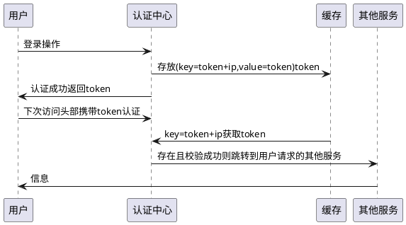

## 声明参与者

关键字 `participant` 用于改变参与者的先后顺序。
你也可以使用其它关键字来声明参与者：

- `actor`
- `boundary`
- `control`
- `entity`
- `database`
- `collections`

```markdown
@startuml
actor Foo1
boundary Foo2
control Foo3
entity Foo4
database Foo5
collections Foo6
Foo1 -> Foo2 : To boundary
Foo1 -> Foo3 : To control
Foo1 -> Foo4 : To entity
Foo1 -> Foo5 : To database
Foo1 -> Foo6 : To collections
@enduml
```

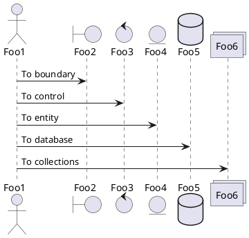

关键字 `as` 用于重命名参与者
你可以使用[RGB](https://plantuml.com/zh/color)值或者颜色名修改 actor 或参与者的背景颜色。

```markdown
@startuml
actor Bob #red
' The only difference between actor
'and participant is the drawing
participant Alice
participant "I have a really\nlong name" as L #99FF99
/' You can also declare:
   participant L as "I have a really\nlong name"  #99FF99
  '/

Alice->Bob: Authentication Request
Bob->Alice: Authentication Response
Bob->L: Log transaction
@enduml
```

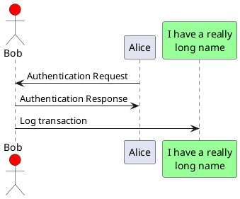

您可以使用关键字 `order`自定义顺序来打印参与者。

```markdown
@startuml
participant Last order 30
participant Middle order 20
participant First order 10
@enduml
```

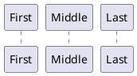

## 在参与者中使用非字母符号

你可以使用引号定义参与者，还可以用关键字 `as` 给参与者定义别名。

```markdown
@startuml
Alice -> "Bob()" : Hello
"Bob()" -> "This is very\nlong" as Long
' You can also declare:
' "Bob()" -> Long as "This is very\nlong"
Long --> "Bob()" : ok
@enduml
```

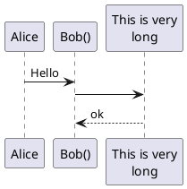

## 给自己发消息

参与者可以给自己发信息，
消息文字可以用`\n`来换行。

```markdown
@startuml
Alice->Alice: This is a signal to self.\nIt also demonstrates\nmultiline \ntext
@enduml
```

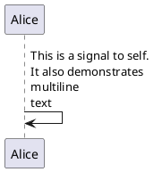

## 修改箭头样式

修改箭头样式的方式有以下几种:
- 表示一条丢失的消息：末尾加 `x`
- 让箭头只有上半部分或者下半部分：将`<`和`>`替换成`\`或者 `/`
- 细箭头：将箭头标记写两次 (如 `>>` 或 `//`)
- 虚线箭头：用 `--` 替代 `-`
- 箭头末尾加圈：`->o`
- 双向箭头：`<->`

```markdown
@startuml
Bob ->x Alice
Bob -> Alice
Bob ->> Alice
Bob -\ Alice
Bob \\- Alice
Bob //-- Alice

Bob ->o Alice
Bob o\\-- Alice

Bob <-> Alice
Bob <->o Alice
@enduml
```

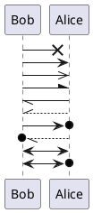

## 修改箭头颜色

你可以用以下记号修改箭头的颜色：

```markdown
@startuml
Bob -[#red]> Alice : hello
Alice -[#0000FF]->Bob : ok
@enduml
```

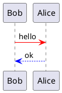

## 对消息序列编号

关键字 `autonumber` 用于自动对消息编号。

```markdown
@startuml
autonumber
Bob -> Alice : Authentication Request
Bob <- Alice : Authentication Response
@enduml
```

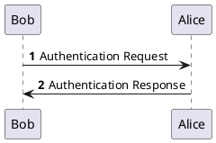

语句 `autonumber //start//` 用于指定编号的初始值，而 `autonumber //start// //increment//` 可以同时指定编号的初始值和每次增加的值。

```markdown
@startuml
autonumber
Bob -> Alice : Authentication Request
Bob <- Alice : Authentication Response

autonumber 15
Bob -> Alice : Another authentication Request
Bob <- Alice : Another authentication Response

autonumber 40 10
Bob -> Alice : Yet another authentication Request
Bob <- Alice : Yet another authentication Response

@enduml
```

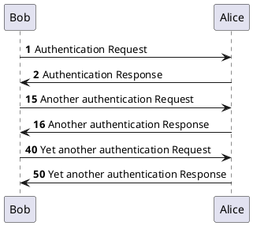
你可以在双引号内指定编号的格式。
格式是由 Java 的`DecimalFormat`类实现的： (`0` 表示数字；`#` 也表示数字，但默认为0)。
你也可以用 HTML 标签来制定格式。

```markdown
@startuml
autonumber "<b>[000]"
Bob -> Alice : Authentication Request
Bob <- Alice : Authentication Response

autonumber 15 "<b>(<u>##</u>)"
Bob -> Alice : Another authentication Request
Bob <- Alice : Another authentication Response

autonumber 40 10 "<font color=red><b>Message 0  "
Bob -> Alice : Yet another authentication Request
Bob <- Alice : Yet another authentication Response

@enduml
```

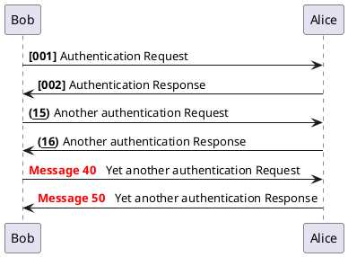

你还可以用语句 `autonumber stop` 和 `autonumber resume //increment// //format//` 来表示暂停或继续使用自动编号。

```markdown
@startuml
autonumber 10 10 "<b>[000]"
Bob -> Alice : Authentication Request
Bob <- Alice : Authentication Response

autonumber stop
Bob -> Alice : dummy

autonumber resume "<font color=red><b>Message 0  "
Bob -> Alice : Yet another authentication Request
Bob <- Alice : Yet another authentication Response

autonumber stop
Bob -> Alice : dummy

autonumber resume 1 "<font color=blue><b>Message 0  "
Bob -> Alice : Yet another authentication Request
Bob <- Alice : Yet another authentication Response
@enduml
```

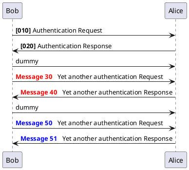

## 页面标题,页眉,页脚

使用`title`关键词增加标题
使用`header`关键词增加页眉
使用`footer`关键词增加页脚

```markdown
@startuml

header Page Header
footer Page %page% of %lastpage%

title Example Title

Alice -> Bob : message 1
Alice -> Bob : message 2

@enduml
```

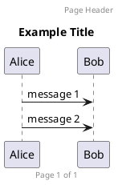

## 分割示意图

关键字 `newpage` 用于把一张图分割成多张。
在 `newpage` 之后添加文字，作为新的示意图的标题。
这样就能很方便地在 *Word* 中将长图分几页打印。

```markdown
@startuml

Alice -> Bob : message 1
Alice -> Bob : message 2

newpage

Alice -> Bob : message 3
Alice -> Bob : message 4

newpage A title for the\nlast page

Alice -> Bob : message 5
Alice -> Bob : message 6
@enduml
```

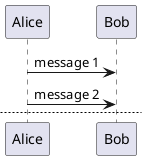

## 组合消息

我们可以通过以下关键词将组合消息：
- `alt/else`
- `opt`
- `loop`
- `par`
- `break`
- `critical`
- `group`, 后面紧跟着消息内容

可以在标头(header)添加需要显示的文字(`group`除外)。
关键词 `end` 用来结束分组。
注意，分组可以嵌套使用。

```markdown
@startuml
Alice -> Bob: Authentication Request

alt successful case

    Bob -> Alice: Authentication Accepted

else some kind of failure

    Bob -> Alice: Authentication Failure
    group My own label
    Alice -> Log : Log attack start
        loop 1000 times
            Alice -> Bob: DNS Attack
        end
    Alice -> Log : Log attack end
    end

else Another type of failure

   Bob -> Alice: Please repeat

end
@enduml
```

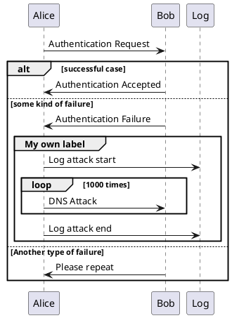

## 给消息添加注释

我们可以通过在消息后面添加 `note left` 或者 `note right` 关键词来给消息添加注释。
你也可以通过使用 `end note` 来添加多行注释。

```markdown
@startuml
Alice->Bob : hello
note left: this is a first note

Bob->Alice : ok
note right: this is another note

Bob->Bob : I am thinking
note left
a note
can also be defined
on several lines
end note
@enduml
```

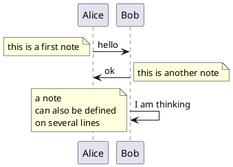

## 其他的注释

可以使用`note left of`，`note right of`或`note over`在节点(participant)的相对位置放置注释。
还可以通过修改[背景色](https://plantuml.com/zh/color)来高亮显示注释。
以及使用关键字`end note`来添加多行注释。

```markdown
@startuml
participant Alice
participant Bob
note left of Alice #aqua
This is displayed
left of Alice.
end note

note right of Alice: This is displayed right of Alice.

note over Alice: This is displayed over Alice.

note over Alice, Bob #FFAAAA: This is displayed\n over Bob and Alice.

note over Bob, Alice
This is yet another
example of
a long note.
end note
@enduml
```

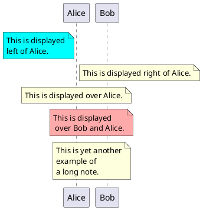

## 改变备注框的形状

你可以使用 `hnote` 和 `rnote` 这两个关键字来修改备注框的形状。

```markdown
@startuml
caller -> server : conReq
hnote over caller : idle
caller <- server : conConf
rnote over server
 "r" as rectangle
 "h" as hexagon
endrnote
@enduml
```

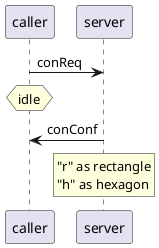

## Creole和HTML

[可以使用creole格式。](https://plantuml.com/zh/creole)

```markdown
@startuml
participant Alice
participant "The **Famous** Bob" as Bob

Alice -> Bob : hello --there--
... Some ~~long delay~~ ...
Bob -> Alice : ok
note left
  This is **bold**
  This is //italics//
  This is ""monospaced""
  This is --stroked--
  This is __underlined__
  This is ~~waved~~
end note

Alice -> Bob : A //well formatted// message
note right of Alice
 This is <back:cadetblue><size:18>displayed</size></back>
 __left of__ Alice.
end note
note left of Bob
 <u:red>This</u> is <color #118888>displayed</color>
 **<color purple>left of</color> <s:red>Alice</strike> Bob**.
end note
note over Alice, Bob
 <w:#FF33FF>This is hosted</w> by 
end note
@enduml
```

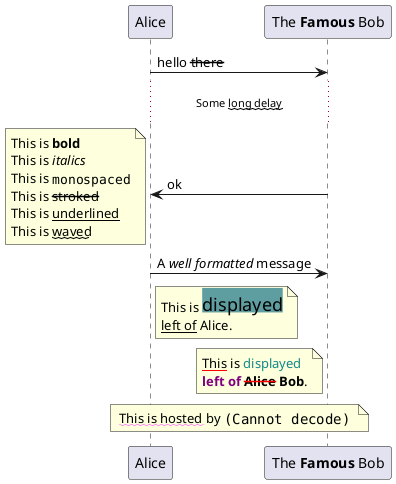

## 分隔符

你可以通过使用 `==` 关键词来将你的图表分割多个步骤。

```markdown
@startuml

== Initialization ==

Alice -> Bob: Authentication Request
Bob --> Alice: Authentication Response

== Repetition ==

Alice -> Bob: Another authentication Request
Alice <-- Bob: another authentication Response

@enduml
```

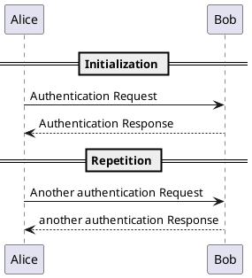

## 引用

你可以在图中通过使用`ref over`关键词来实现引用

```markdown
@startuml
participant Alice
actor Bob

ref over Alice, Bob : init

Alice -> Bob : hello

ref over Bob
  This can be on
  several lines
end ref
@enduml
```

```plantuml
@startuml
participant Alice
actor Bob

ref over Alice, Bob : init

Alice -> Bob : hello

ref over Bob
  This can be on
  several lines
end ref
@enduml
```

## 延迟

你可以使用`...`来表示延迟，并且还可以给延迟添加注释。

```markdown
@startuml

Alice -> Bob: Authentication Request
...
Bob --> Alice: Authentication Response
...5 minutes latter...
Bob --> Alice: Bye !

@enduml
```

```plantuml
@startuml

Alice -> Bob: Authentication Request
...
Bob --> Alice: Authentication Response
...5 minutes latter...
Bob --> Alice: Bye !

@enduml
```

## 空间

你可以使用`|||`来增加空间。
还可以使用数字指定增加的像素的数量。

```markdown
@startuml

Alice -> Bob: message 1
Bob --> Alice: ok
|||
Alice -> Bob: message 2
Bob --> Alice: ok
||45||
Alice -> Bob: message 3
Bob --> Alice: ok

@enduml
```

```plantuml
@startuml

Alice -> Bob: message 1
Bob --> Alice: ok
|||
Alice -> Bob: message 2
Bob --> Alice: ok
||45||
Alice -> Bob: message 3
Bob --> Alice: ok

@enduml
```

## 生命线的激活与撤销

关键字`activate`和`deactivate`用来表示参与者的生命活动。
一旦参与者被激活，它的生命线就会显示出来。
`activate`和`deactivate`适用于以上情形。
`destroy`表示一个参与者的生命线的终结。

```markdown
@startuml
participant User

User -> A: DoWork
activate A

A -> B: << createRequest >>
activate B

B -> C: DoWork
activate C
C --> B: WorkDone
destroy C

B --> A: RequestCreated
deactivate B

A -> User: Done
deactivate A

@enduml
```

```plantuml
@startuml
participant User

User -> A: DoWork
activate A

A -> B: << createRequest >>
activate B

B -> C: DoWork
activate C
C --> B: WorkDone
destroy C

B --> A: RequestCreated
deactivate B

A -> User: Done
deactivate A

@enduml
```

还可以使用嵌套的生命线，并且运行给生命线添加颜色。

```markdown
@startuml
participant User

User -> A: DoWork
activate A #FFBBBB

A -> A: Internal call
activate A #DarkSalmon

A -> B: << createRequest >>
activate B

B --> A: RequestCreated
deactivate B
deactivate A
A -> User: Done
deactivate A

@enduml
```

```plantuml
@startuml
participant User

User -> A: DoWork
activate A #FFBBBB

A -> A: Internal call
activate A #DarkSalmon

A -> B: << createRequest >>
activate B

B --> A: RequestCreated
deactivate B
deactivate A
A -> User: Done
deactivate A

@enduml
```

## Return

A new command `return` for generating a return message with optional text label. The point returned to is the point that cause the most recently activated life-line. The syntax is simply return label where label, if provided, can be any string acceptable on conventional messages.

```markdown
@startuml
Bob -> Alice : hello
activate Alice
Alice -> Alice : some action
return bye
@enduml
```

```plantuml
@startuml
Bob -> Alice : hello
activate Alice
Alice -> Alice : some action
return bye
@enduml
```

## 创建参与者

你可以把关键字`create`放在第一次接收到消息之前，以强调本次消息实际上是在*创建*新的对象。

```markdown
@startuml
Bob -> Alice : hello

create Other
Alice -> Other : new

create control String
Alice -> String
note right : You can also put notes!

Alice --> Bob : ok

@enduml
```

```plantuml
@startuml
Bob -> Alice : hello

create Other
Alice -> Other : new

create control String
Alice -> String
note right : You can also put notes!

Alice --> Bob : ok

@enduml
```

## Shortcut syntax for activation, deactivation, creation

Immediately after specifying the target participant, the following syntax can be used:
- `++` Activate the target (optionally a #color may follow this)
- `--` Deactivate the source
- `**` Create an instance of the target
- `!!` Destroy an instance of the target

```markdown
@startuml
alice -> bob ++ : hello
bob -> bob ++ : self call
bob -> bib ++  #005500 : hello
bob -> george ** : create
return done
return rc
bob -> george !! : delete
return success
@enduml
```

```plantuml
@startuml
alice -> bob ++ : hello
bob -> bob ++ : self call
bob -> bib ++  #005500 : hello
bob -> george ** : create
return done
return rc
bob -> george !! : delete
return success
@enduml
```

## 进入和发出消息

如果只想关注部分图示，你可以使用进入和发出箭头。
使用方括号`[`和`]`表示图示的左、右两侧。

```markdown
@startuml
[-> A: DoWork

activate A

A -> A: Internal call
activate A

A ->] : << createRequest >>

A<--] : RequestCreated
deactivate A
[<- A: Done
deactivate A
@enduml
```

```plantuml
@startuml
[-> A: DoWork

activate A

A -> A: Internal call
activate A

A ->] : << createRequest >>

A<--] : RequestCreated
deactivate A
[<- A: Done
deactivate A
@enduml
```

还可以使用下面的语法:

```markdown
@startuml
[-> Bob
[o-> Bob
[o->o Bob
[x-> Bob

[<- Bob
[x<- Bob

Bob ->]
Bob ->o]
Bob o->o]
Bob ->x]

Bob <-]
Bob x<-]
@enduml
```

```plantuml
@startuml
[-> Bob
[o-> Bob
[o->o Bob
[x-> Bob

[<- Bob
[x<- Bob

Bob ->]
Bob ->o]
Bob o->o]
Bob ->x]

Bob <-]
Bob x<-]
@enduml
```

## Anchors and Duration

With `teoz` usage it is possible to add anchors to the diagram and use the anchors to specify duration time.

```markdown
@startuml
!pragma teoz true

{start} Alice -> Bob : start doing things during duration
Bob -> Max : something
Max -> Bob : something else
{end} Bob -> Alice : finish

{start} <-> {end} : some time

@enduml
```

```plantuml
@startuml
!pragma teoz true

{start} Alice -> Bob : start doing things during duration
Bob -> Max : something
Max -> Bob : something else
{end} Bob -> Alice : finish

{start} <-> {end} : some time

@enduml
```

## 构造类型和圈点

可以使用`<<`和`>>`给参与者添加构造类型。
在构造类型中，你可以使用`(X,color)`格式的语法添加一个圆圈圈起来的字符。

```markdown
@startuml

participant "Famous Bob" as Bob << Generated >>
participant Alice << (C,#ADD1B2) Testable >>

Bob->Alice: First message

@enduml
```

```plantuml
@startuml

participant "Famous Bob" as Bob << Generated >>
participant Alice << (C,#ADD1B2) Testable >>

Bob->Alice: First message

@enduml
```

默认使用 *guillemet* 字符来显示构造类型。 你可以使用外观参数 `guillemet` 来修改显示行为。

```markdown
@startuml

skinparam guillemet false
participant "Famous Bob" as Bob << Generated >>
participant Alice << (C,#ADD1B2) Testable >>

Bob->Alice: First message

@enduml
```

```plantuml
@startuml

skinparam guillemet false
participant "Famous Bob" as Bob << Generated >>
participant Alice << (C,#ADD1B2) Testable >>

Bob->Alice: First message

@enduml
```

```markdown
@startuml

participant Bob << (C,#ADD1B2) >>
participant Alice << (C,#ADD1B2) >>

Bob->Alice: First message

@enduml
```

```plantuml
@startuml

participant Bob << (C,#ADD1B2) >>
participant Alice << (C,#ADD1B2) >>

Bob->Alice: First message

@enduml
```

## 更多标题信息

你可以在标题中使用[creole](https://plantuml.com/zh/creole)格式。

```markdown
@startuml

title __Simple__ **communication** example

Alice -> Bob: Authentication Request
Bob -> Alice: Authentication Response

@enduml
```

```plantuml
@startuml

title __Simple__ **communication** example

Alice -> Bob: Authentication Request
Bob -> Alice: Authentication Response

@enduml
```

在标题描述中使用`\n`表示换行。

```markdown
@startuml

title __Simple__ communication example\non several lines

Alice -> Bob: Authentication Request
Bob -> Alice: Authentication Response

@enduml
```

```plantuml
@startuml

title __Simple__ communication example\non several lines

Alice -> Bob: Authentication Request
Bob -> Alice: Authentication Response

@enduml
```

还可以使用关键字`title`和`end title`定义多行标题。

```markdown
@startuml

title
 <u>Simple</u> communication example
 on <i>several</i> lines and using <font color=red>html</font>
 This is hosted by 
end title

Alice -> Bob: Authentication Request
Bob -> Alice: Authentication Response

@enduml
```

```plantuml
@startuml

title
 <u>Simple</u> communication example
 on <i>several</i> lines and using <font color=red>html</font>
 This is hosted by 
end title

Alice -> Bob: Authentication Request
Bob -> Alice: Authentication Response

@enduml
```

## 包裹参与者

可以使用`box`和`end box`画一个盒子将参与者包裹起来。
还可以在`box`关键字之后添加标题或者背景颜色。

```markdown
@startuml

box "Internal Service" #LightBlue
participant Bob
participant Alice
end box
participant Other

Bob -> Alice : hello
Alice -> Other : hello

@enduml
```

```plantuml
@startuml

box "Internal Service" #LightBlue
participant Bob
participant Alice
end box
participant Other

Bob -> Alice : hello
Alice -> Other : hello

@enduml
```

## 移除脚注

使用`hide footbox`关键字移除脚注。

```markdown
@startuml

hide footbox
title Footer removed

Alice -> Bob: Authentication Request
Bob --> Alice: Authentication Response

@enduml
```

```plantuml
@startuml

hide footbox
title Footer removed

Alice -> Bob: Authentication Request
Bob --> Alice: Authentication Response

@enduml
```

## 外观参数(skinparam)

用[skinparam](https://plantuml.com/zh/skinparam)改变字体和颜色。
可以在如下场景中使用：
- 在图示的定义中，
- [在引入的文件中](https://plantuml.com/zh/preprocessing)，
- 在[命令行](https://plantuml.com/zh/command-line)或者[ANT任务](https://plantuml.com/zh/ant-task)提供的配置文件中。

你也可以修改其他渲染元素，如以下示例：

```markdown
@startuml
skinparam sequenceArrowThickness 2
skinparam roundcorner 20
skinparam maxmessagesize 60
skinparam sequenceParticipant underline

actor User
participant "First Class" as A
participant "Second Class" as B
participant "Last Class" as C

User -> A: DoWork
activate A

A -> B: Create Request
activate B

B -> C: DoWork
activate C
C --> B: WorkDone
destroy C

B --> A: Request Created
deactivate B

A --> User: Done
deactivate A

@enduml
```

```plantuml
@startuml
skinparam sequenceArrowThickness 2
skinparam roundcorner 20
skinparam maxmessagesize 60
skinparam sequenceParticipant underline

actor User
participant "First Class" as A
participant "Second Class" as B
participant "Last Class" as C

User -> A: DoWork
activate A

A -> B: Create Request
activate B

B -> C: DoWork
activate C
C --> B: WorkDone
destroy C

B --> A: Request Created
deactivate B

A --> User: Done
deactivate A

@enduml
```

```markdown
@startuml
skinparam backgroundColor #EEEBDC
skinparam handwritten true

skinparam sequence {
ArrowColor DeepSkyBlue
ActorBorderColor DeepSkyBlue
LifeLineBorderColor blue
LifeLineBackgroundColor #A9DCDF

ParticipantBorderColor DeepSkyBlue
ParticipantBackgroundColor DodgerBlue
ParticipantFontName Impact
ParticipantFontSize 17
ParticipantFontColor #A9DCDF

ActorBackgroundColor aqua
ActorFontColor DeepSkyBlue
ActorFontSize 17
ActorFontName Aapex
}

actor User
participant "First Class" as A
participant "Second Class" as B
participant "Last Class" as C

User -> A: DoWork
activate A

A -> B: Create Request
activate B

B -> C: DoWork
activate C
C --> B: WorkDone
destroy C

B --> A: Request Created
deactivate B

A --> User: Done
deactivate A

@enduml
```

```plantuml
@startuml
skinparam backgroundColor #EEEBDC
skinparam handwritten true

skinparam sequence {
ArrowColor DeepSkyBlue
ActorBorderColor DeepSkyBlue
LifeLineBorderColor blue
LifeLineBackgroundColor #A9DCDF

ParticipantBorderColor DeepSkyBlue
ParticipantBackgroundColor DodgerBlue
ParticipantFontName Impact
ParticipantFontSize 17
ParticipantFontColor #A9DCDF

ActorBackgroundColor aqua
ActorFontColor DeepSkyBlue
ActorFontSize 17
ActorFontName Aapex
}

actor User
participant "First Class" as A
participant "Second Class" as B
participant "Last Class" as C

User -> A: DoWork
activate A

A -> B: Create Request
activate B

B -> C: DoWork
activate C
C --> B: WorkDone
destroy C

B --> A: Request Created
deactivate B

A --> User: Done
deactivate A

@enduml
```

## 填充区设置

可以设定填充区的参数配置。

```markdown
@startuml
skinparam ParticipantPadding 20
skinparam BoxPadding 10

box "Foo1"
participant Alice1
participant Alice2
end box
box "Foo2"
participant Bob1
participant Bob2
end box
Alice1 -> Bob1 : hello
Alice1 -> Out : out
@enduml
```

```plantuml
@startuml
skinparam ParticipantPadding 20
skinparam BoxPadding 10

box "Foo1"
participant Alice1
participant Alice2
end box
box "Foo2"
participant Bob1
participant Bob2
end box
Alice1 -> Bob1 : hello
Alice1 -> Out : out
@enduml
```

