# 第二章 第10节：线框图形界面

**Salt** 是 PlantUML 下面的子项目用来帮助用户来设计图形接口.

可以用 `@startsalt` 关键字，或者使用 `@startuml` 紧接着下一行使用`salt` 关键字.

## 基本部件

一个窗口必须以中括号开头和结尾。 接着可以这样定义:

- 按钮用 `[` 和 `]`。
- 单选按钮用 `(` 和 `)`。
- 复选框用 `[` 和 `]`。
- 用户文字域用 `"`。

```markdown
@startsalt
{
  Just plain text
  [This is my button]
  ()  Unchecked radio
  (X) Checked radio
  []  Unchecked box
  [X] Checked box
  "Enter text here   "
  ^This is a droplist^
}
@endsalt
```

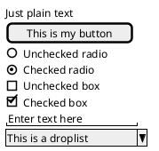

这个工具是用来讨论简单的示例窗口。

## 使用表格

当在输入关键词 `{`后，会自动建立一个表格  

当输入`|` 说明一个单元格  

例子如下

```markdown
@startsalt
{
  Login    | "MyName   "
  Password | "****     "
  [Cancel] | [  OK   ]
}
@endsalt
```

```plantuml
@startsalt
{
  Login    | "MyName   "
  Password | "****     "
  [Cancel] | [  OK   ]
}
@endsalt
```

在启用关键词后，你可以使用以下字符来绘制表格中的线及列 :

| **Symbol** | **Result**         |
| ---------- | ------------------ |
| `#`        | 显示所有垂直水平线 |
| `!`        | 显示所有垂直线     |
| `-`        | 显示所有水平线     |
| `+`        | 显示外框线         |

```markdown
@startsalt
{+
  Login    | "MyName   "
  Password | "****     "
  [Cancel] | [  OK   ]
}
@endsalt
```

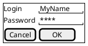

## Group box

```markdown
@startsalt
{^"My group box"
  Login    | "MyName   "
  Password | "****     "
  [Cancel] | [  OK   ]
}
@endsalt
```

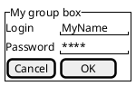

## 使用分隔符

你可以使用几条横线表示分隔符

```markdown
@startuml
salt
{
  Text1
  ..
  "Some field"
  ==
  Note on usage
  ~~
  Another text
  --
  [Ok]
}
@enduml
```

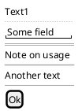

## 树形外挂

使用树结构，你必须要 以 `{T` 进行起始，然后使用 `+` 定义层次。

```markdown
@startsalt
{
{T
 + World
 ++ America
 +++ Canada
 +++ USA
 ++++ New York
 ++++ Boston
 +++ Mexico
 ++ Europe
 +++ Italy
 +++ Germany
 ++++ Berlin
 ++ Africa
}
}
@endsalt
```

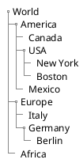

## Enclosing brackets

You can define subelements by opening a new opening bracket.

```markdown
@startsalt
{
Name         | "                 "
Modifiers:   | { (X) public | () default | () private | () protected
                [] abstract | [] final   | [] static }
Superclass:  | { "java.lang.Object " | [Browse...] }
}
@endsalt
```

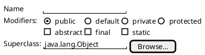

## 添加选项卡

你可以通过 `{/` 标记增加对应的选项卡。 注意：可以使用HTML 代码来增加粗体效果。

```markdown
@startsalt
{+
{/ <b>General | Fullscreen | Behavior | Saving }
{
{ Open image in: | ^Smart Mode^ }
[X] Smooth images when zoomed
[X] Confirm image deletion
[ ] Show hidden images
}
[Close]
}
@endsalt
```

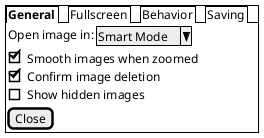

可以定义垂直选项卡，如下:

```markdown
@startsalt
{+
{/ <b>General
Fullscreen
Behavior
Saving } |
{
{ Open image in: | ^Smart Mode^ }
[X] Smooth images when zoomed
[X] Confirm image deletion
[ ] Show hidden images
[Close]
}
}
@endsalt
```

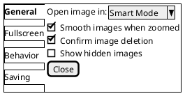

## 使用菜单

你可以使用记号`{*`来添加菜单。

```markdown
@startsalt
{+
{* File | Edit | Source | Refactor }
{/ General | Fullscreen | Behavior | Saving }
{
{ Open image in: | ^Smart Mode^ }
[X] Smooth images when zoomed
[X] Confirm image deletion
[ ] Show hidden images
}
[Close]
}
@endsalt
```

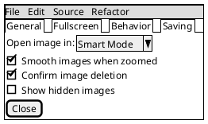

你也可以打开一个菜单：

```markdown
@startsalt
{+
{* File | Edit | Source | Refactor
 Refactor | New | Open File | - | Close | Close All }
{/ General | Fullscreen | Behavior | Saving }
{
{ Open image in: | ^Smart Mode^ }
[X] Smooth images when zoomed
[X] Confirm image deletion
[ ] Show hidden images
}
[Close]
}
@endsalt
```

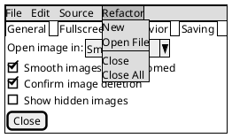

## 高级表格

对于表格有两种特殊的标记 :

- `*` 单元格同时具备 span 和 left 两个属性
- `.` 是空白单元格

```markdown
@startsalt
{#
. | Column 2 | Column 3
Row header 1 | value 1 | value 2
Row header 2 | A long cell | *
}
@endsalt
```

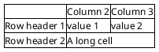

## OpenIconic

[OpenIconic](https://useiconic.com/open/) is an very nice open source icon set. Those icons have been integrated into the [creole parser](https://plantuml.com/zh/creole), so you can use them out-of-the-box.  

You can use the following syntax: `<&ICON_NAME>`.

```markdown
@startsalt
{
  Login<&person> | "MyName   "
  Password<&key> | "****     "
  [Cancel <&circle-x>] | [OK <&account-login>]
}
@endsalt
```

```plantuml
@startsalt
{
  Login<&person> | "MyName   "
  Password<&key> | "****     "
  [Cancel <&circle-x>] | [OK <&account-login>]
}
@endsalt
```

The complete list is available on [OpenIconic Website](https://useiconic.com/open/), or you can use the following special diagram:

```markdown
@startuml
listopeniconic
@enduml
```

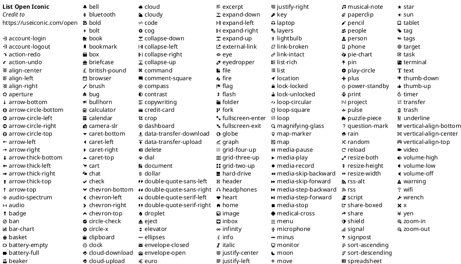

## Include Salt

You can [read the following explanation](http://forum.plantuml.net/2427/salt-with-minimum-flowchat-capabilities?show=2427#q2427).

```markdown
@startuml
(*) --> "
{{
salt
{+
<b>an example
choose one option
()one
()two
[ok]
}
}}
" as choose

choose -right-> "
{{
salt
{+
<b>please wait
operation in progress
<&clock>
[cancel]
}
}}
" as wait
wait -right-> "
{{
salt
{+
<b>success
congratulations!
[ok]
}
}}
" as success

wait -down-> "
{{
salt
{+
<b>error
failed, sorry
[ok]
}
}}
"
@enduml
```

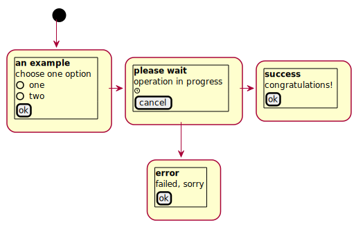

It can also be combined with [define macro](https://plantuml.com/zh/preprocessing#macro_definition).

```markdown
@startuml
!unquoted procedure SALT($x)
"{{
salt
%invoke_procedure("_"+$x)
}}" as $x
!endprocedure

!procedure _choose()
{+
<b>an example
choose one option
()one
()two
[ok]
}
!endprocedure

!procedure _wait()
{+
<b>please wait
operation in progress
<&clock>
[cancel]
}
!endprocedure

!procedure _success()
{+
<b>success
congratulations!
[ok]
}
!endprocedure

!procedure _error()
{+
<b>error
failed, sorry
[ok]
}
!endprocedure

(*) --> SALT(choose)
-right-> SALT(wait)
wait -right-> SALT(success)
wait -down-> SALT(error)
@enduml
```


## Scroll Bars

You can use "S" as scroll bar like in following examples:

```markdown
@startsalt
{S
Message
.
.
.
.
}
@endsalt
```

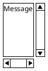

```markdown
@startsalt
{SI
Message
.
.
.
.
}
@endsalt
```

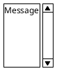

```markdown
@startsalt
{S-
Message
.
.
.
.
}
@endsalt
```

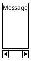

