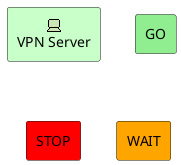
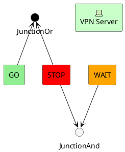
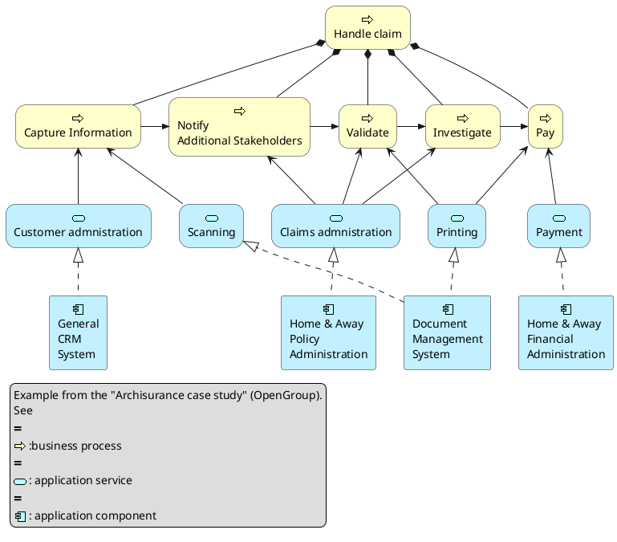
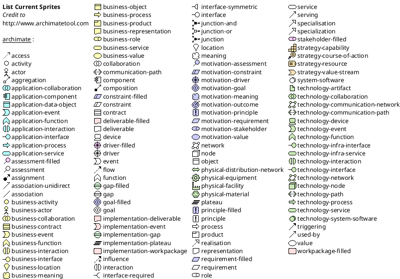

# 第二章 第11节：架构图

This is only a proposal and subject to change.  

You are very welcome [to create a new discussion](http://forum.plantuml.net/) on this future syntax. Your feedbacks, ideas and suggestions help us to find the right solution.

## Archimate keyword

You can use the `archimate` keyword to define an element. Stereotype can optionally specify an additional icon. Some colors (`Business`, `Application`, `Motivation`, `Strategy`, `Technology`, `Physical`, `Implementation`) are also available.

```markdown
@startuml
archimate #Technology "VPN Server" as vpnServerA <<technology-device>>

rectangle GO #lightgreen
rectangle STOP #red
rectangle WAIT #orange
@enduml
```



## Defining Junctions

Using the `circle` keyword and the [preprocessor](https://plantuml.com/zh/preprocessing), you can also create junctions.

```markdown
@startuml
!define Junction_Or circle #black
!define Junction_And circle #whitesmoke

Junction_And JunctionAnd
Junction_Or JunctionOr

archimate #Technology "VPN Server" as vpnServerA <<technology-device>>

rectangle GO #lightgreen
rectangle STOP #red
rectangle WAIT #orange
GO -up-> JunctionOr
STOP -up-> JunctionOr
STOP -down-> JunctionAnd
WAIT -down-> JunctionAnd
@enduml
```



## Example 1

```markdown
@startuml
skinparam rectangle<<behavior>> {
	roundCorner 25
}
sprite $bProcess jar:archimate/business-process
sprite $aService jar:archimate/application-service
sprite $aComponent jar:archimate/application-component

rectangle "Handle claim"  as HC <<$bProcess>><<behavior>> #Business
rectangle "Capture Information"  as CI <<$bProcess>><<behavior>> #Business
rectangle "Notify\nAdditional Stakeholders" as NAS <<$bProcess>><<behavior>> #Business
rectangle "Validate" as V <<$bProcess>><<behavior>> #Business
rectangle "Investigate" as I <<$bProcess>><<behavior>> #Business
rectangle "Pay" as P <<$bProcess>><<behavior>> #Business

HC *-down- CI
HC *-down- NAS
HC *-down- V
HC *-down- I
HC *-down- P

CI -right->> NAS
NAS -right->> V
V -right->> I
I -right->> P

rectangle "Scanning" as scanning <<$aService>><<behavior>> #Application
rectangle "Customer admnistration" as customerAdministration <<$aService>><<behavior>> #Application
rectangle "Claims admnistration" as claimsAdministration <<$aService>><<behavior>> #Application
rectangle Printing <<$aService>><<behavior>> #Application
rectangle Payment <<$aService>><<behavior>> #Application

scanning -up-> CI
customerAdministration  -up-> CI
claimsAdministration -up-> NAS
claimsAdministration -up-> V
claimsAdministration -up-> I
Payment -up-> P

Printing -up-> V
Printing -up-> P

rectangle "Document\nManagement\nSystem" as DMS <<$aComponent>> #Application
rectangle "General\nCRM\nSystem" as CRM <<$aComponent>>  #Application
rectangle "Home & Away\nPolicy\nAdministration" as HAPA <<$aComponent>> #Application
rectangle "Home & Away\nFinancial\nAdministration" as HFPA <<$aComponent>>  #Application

DMS .up.|> scanning
DMS .up.|> Printing
CRM .up.|> customerAdministration
HAPA .up.|> claimsAdministration
HFPA .up.|> Payment

legend left
Example from the "Archisurance case study" (OpenGroup).
See
==
<$bProcess> :business process
==
<$aService> : application service
==
<$aComponent> : application component
endlegend
@enduml
```



## Example 2

```markdown
@startuml
skinparam roundcorner 25
rectangle "Capture Information"  as CI <<$archimate/business-process>> #Business
@enduml
```



```plantuml
@startuml
skinparam roundcorner 25
rectangle "Capture Information"  as CI <<$archimate/business-process>> #Business
@enduml
```

## List possible sprites

You can list all possible sprites for Archimate using the following diagram:

```markdown
@startuml
listsprite
@enduml
```



## ArchiMate Macros

A list of Archimate marcros are defined [Archimate-PlantUML](https://github.com/ebbypeter/Archimate-PlantUML) here which simplifies the creation of ArchiMate diagrams.  

Using the macros, creation of ArchiMate elements are done using the following format:

```
Category_ElementName(nameOfTheElement, "description")
```

For Example:

- To define a Stakeholder element, which is part of Motivation category, the syntax will be `Motivation_Stakeholder(StakeholderElement, "Stakeholder Description")`
- To define a Business Service element,

```
Business_Service(BService, "Business Service")
```

The ArchiMate relationships are defined with the following pattern: `Rel_RelationType(fromElement, toElement, "description")` and to define the direction / orientation of the two elements: `Rel_RelationType_Direction(fromElement, toElement, "description")`

The RelationTypes supported are:  

- Access
- Aggregation
- Assignment
- Association
- Composition
- Flow
- Influence
- Realization
- Serving
- Specilization
- Triggering

The Directions supported are:  

- Up
- Down
- Left
- Right

For example:

- To denote a composition relationship between the Stakeholder and Business Service defined above, the syntax will be

```
Rel_Composition(StakeholderElement, BService, "Description for the relationship")
```

- Unordered List ItemTo orient the two elements in top - down position, the syntax will be

```
Rel_Composition_Down(StakeholderElement, BService, "Description for the relationship")
```