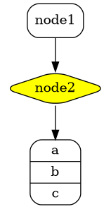

# 第二章 第13节：Ditaa diagram

原来，图表的描述需要以"@startuml"开头，以`@enduml`结束，**PlantUML**在支持UML同时支持其他图表，既然如此，"@startuml"就没有存在的必要了。  

所以，通用规则允许图表描述以`@startXYZ`开头，以`@endXYZ`结束，"XYZ"根据图表的类型而改变。  

注意，`XYZ`可以是任何字符串（包括空格）。  

> 这意味着我们鼓励插件开发者，以`@start`代替`@startuml`作为标识。

## Ditaa

[Ditaa](http://ditaa.sourceforge.net/) 是一个支持通过文本描述生成通用图表的开源项目。这个理念和**PlantUML**非常相近，所以，支持除UML之外其他图表的文档化将会很有很有意义。  

所以最新版本的**PlantUML**支持下面的语法：  

```markdown
@startuml
ditaa
+--------+   +-------+    +-------+
|        +---+ ditaa +--> |       |
|  Text  |   +-------+    |diagram|
|Document|   |!magic!|    |       |
|     {d}|   |       |    |       |
+---+----+   +-------+    +-------+
    :                         ^
    |       Lots of work      |
    +-------------------------+
@enduml
```

```plantuml
@startuml
ditaa
+--------+   +-------+    +-------+
|        +---+ ditaa +--> |       |
|  Text  |   +-------+    |diagram|
|Document|   |!magic!|    |       |
|     {d}|   |       |    |       |
+---+----+   +-------+    +-------+
    :                         ^
    |       Lots of work      |
    +-------------------------+
@enduml
```

你可以在 [这里](http://ditaa.sourceforge.net/) 找到它的完整的文档。  

如果你的插件还不支持`@startditaa`，可以使用 *临时* 解决方案：在你的文档描述首行使用`@startuml`，通过`ditta`关键字来支持 [Ditaa](http://ditaa.sourceforge.net/) 。  

你同样可以在`@startditaa`或者`@ditta`关键字后面使用一些设置：  

- `-E` 或者 `--no-separation` 移除分隔符
- `-S` 或者 `--no-shadows` 移除阴影
- `scale=XYZ` to 缩放图表

```markdown
@startuml
ditaa(--no-shadows, scale=0.8)
/--------\   +-------+
|cAAA    +---+Version|
|  Data  |   |   V3  |
|  Base  |   |cRED{d}|
|     {s}|   +-------+
\---+----/
@enduml
```

```plantuml
@startuml
ditaa(--no-shadows, scale=0.8)
/--------\   +-------+
|cAAA    +---+Version|
|  Data  |   |   V3  |
|  Base  |   |cRED{d}|
|     {s}|   +-------+
\---+----/
@enduml
```

只支持PNG格式。

## DOT

自从 **PlantUML** 使用 [Graphviz/DOT](http://www.graphviz.org/Gallery.php)语法，直接使用DOT语言成为可能。  

这意味着你可以使用 Graphviz/DOT 所有支持**PlantUML**的工具。  

注意，起始行必须是：  

```markdown
digraph XYZ {
```

注意，你同样可以使用`@startuml`/`@enduml`代替`@startdot`/`@enddot`：  

这里有一个实例：

```markdown
@startuml
digraph foo {
  node [style=rounded]
  node1 [shape=box]
  node2 [fillcolor=yellow, style="rounded,filled", shape=diamond]
  node3 [shape=record, label="{ a | b | c }"]

  node1 -> node2 -> node3
}
@enduml
```



