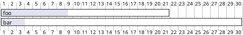
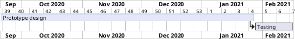

# 第二章 第14节：甘特图 

This is only a proposal and subject to change.  

You are very welcome [to create a new discussion](http://forum.plantuml.net/) on this future syntax. Your feedbacks, ideas and suggestions help us to find the right solution.  

The Gantt is described in *natural* language, using very simple sentences (subject-verb-complement).

## Declaring tasks

Tasks defined using square bracket. Their durations are defined using the `last` verb:

```markdown
@startuml
[Prototype design] lasts 15 days
[Test prototype] lasts 10 days
@enduml
```

```plantuml
@startuml
[Prototype design] lasts 15 days
[Test prototype] lasts 10 days
@enduml
```

## Adding constraints

It is possible to add constraints between task.

```markdown
@startuml
[Prototype design] lasts 15 days
[Test prototype] lasts 10 days
[Test prototype] starts at [Prototype design]'s end
@enduml
```

```plantuml
@startuml
[Prototype design] lasts 15 days
[Test prototype] lasts 10 days
[Test prototype] starts at [Prototype design]'s end
@enduml
```

```markdown
@startuml
[Prototype design] lasts 10 days
[Code prototype] lasts 10 days
[Write tests] lasts 5 days
[Code prototype] starts at [Prototype design]'s end
[Write tests] starts at [Code prototype]'s start
@enduml
```

```plantuml
@startuml
[Prototype design] lasts 10 days
[Code prototype] lasts 10 days
[Write tests] lasts 5 days
[Code prototype] starts at [Prototype design]'s end
[Write tests] starts at [Code prototype]'s start
@enduml
```

## Short names

It is possible to define short name for tasks with the `as` keyword.

```markdown
@startuml
[Prototype design] as [D] lasts 15 days
[Test prototype] as [T] lasts 10 days
[T] starts at [D]'s end
@enduml
```

```plantuml
@startuml
[Prototype design] as [D] lasts 15 days
[Test prototype] as [T] lasts 10 days
[T] starts at [D]'s end
@enduml
```

## Customize colors

It also possible to customize [colors](https://www.w3schools.com/colors/colors_names.asp).

```markdown
@startuml
[Prototype design] lasts 13 days
[Test prototype] lasts 4 days
[Test prototype] starts at [Prototype design]'s end
[Prototype design] is colored in Fuchsia/FireBrick
[Test prototype] is colored in GreenYellow/Green
@enduml
```

```plantuml
@startuml
[Prototype design] lasts 13 days
[Test prototype] lasts 4 days
[Test prototype] starts at [Prototype design]'s end
[Prototype design] is colored in Fuchsia/FireBrick
[Test prototype] is colored in GreenYellow/Green
@enduml
```

## Completion status

You can set the completion status of a task.

```markdown
@startgantt
[foo] lasts 21 days
[foo] is 40% completed
[bar] lasts 30 days and is 10% complete
@endgantt
```



## Milestone

You can define Milestones using the `happens` verb.

```markdown
@startuml
[Test prototype] lasts 10 days
[Prototype completed] happens at [Test prototype]'s end
[Setup assembly line] lasts 12 days
[Setup assembly line] starts at [Test prototype]'s end
@enduml
```

```plantuml
@startuml
[Test prototype] lasts 10 days
[Prototype completed] happens at [Test prototype]'s end
[Setup assembly line] lasts 12 days
[Setup assembly line] starts at [Test prototype]'s end
@enduml
```

## Hyperlinks

You can add hyperlinks to tasks.

```markdown
@startgantt
[task1] lasts 10 days
[task1] links to [[http://plantuml.com]]
@endgantt
```



```plantuml
@startgantt
[task1] lasts 10 days
[task1] links to [[http://plantuml.com]]
@endgantt
```

## Calendar

You can specify a starting date for the whole project. By default, the first task starts at this date.

```markdown
@startuml
Project starts the 20th of september 2017
[Prototype design] as [TASK1] lasts 13 days
[TASK1] is colored in Lavender/LightBlue
@enduml
```

```plantuml
@startuml
Project starts the 20th of september 2017
[Prototype design] as [TASK1] lasts 13 days
[TASK1] is colored in Lavender/LightBlue
@enduml
```

## Changing scale

You can change scale for very long project

```markdown
@startgantt
printscale weekly
Project starts the 20th of september 2020
[Prototype design] as [TASK1] lasts 130 days
[TASK1] is colored in Lavender/LightBlue
[Testing] lasts 20 days
[TASK1]->[Testing]
@endgantt
```



## Close day

It is possible to close some day.

```markdown
@startuml
project starts the 2018/04/09
saturday are closed
sunday are closed
2018/05/01 is closed
2018/04/17 to 2018/04/19 is closed
[Prototype design] lasts 14 days
[Test prototype] lasts 4 days
[Test prototype] starts at [Prototype design]'s end
[Prototype design] is colored in Fuchsia/FireBrick
[Test prototype] is colored in GreenYellow/Green
@enduml
```

```plantuml
@startuml
project starts the 2018/04/09
saturday are closed
sunday are closed
2018/05/01 is closed
2018/04/17 to 2018/04/19 is closed
[Prototype design] lasts 14 days
[Test prototype] lasts 4 days
[Test prototype] starts at [Prototype design]'s end
[Prototype design] is colored in Fuchsia/FireBrick
[Test prototype] is colored in GreenYellow/Green
@enduml
```

## Simplified task succession

It's possible to use the `then` keyword to denote consecutive tasks.

```markdown
@startuml
[Prototype design] lasts 14 days
then [Test prototype] lasts 4 days
then [Deploy prototype] lasts 6 days
@enduml
```

```plantuml
@startuml
[Prototype design] lasts 14 days
then [Test prototype] lasts 4 days
then [Deploy prototype] lasts 6 days
@enduml
```

You can also use arrow `->`

```markdown
@startuml
[Prototype design] lasts 14 days
[Build prototype] lasts 4 days
[Prepare test] lasts 6 days
[Prototype design] -> [Build prototype]
[Prototype design] -> [Prepare test]
@enduml
```

```plantuml
@startuml
[Prototype design] lasts 14 days
[Build prototype] lasts 4 days
[Prepare test] lasts 6 days
[Prototype design] -> [Build prototype]
[Prototype design] -> [Prepare test]
@enduml
```

## Separator

You can use `--` to separate sets of tasks.

```markdown
@startuml
[Task1] lasts 10 days
then [Task2] lasts 4 days
-- Phase Two --
then [Task3] lasts 5 days
then [Task4] lasts 6 days
@enduml
```

```plantuml
@startuml
[Task1] lasts 10 days
then [Task2] lasts 4 days
-- Phase Two --
then [Task3] lasts 5 days
then [Task4] lasts 6 days
@enduml
```

## Working with resources

You can affect tasks on resources using the `on` keyword and brackets for resource name.

```markdown
@startuml
[Task1] on {Alice} lasts 10 days
[Task2] on {Bob:50%} lasts 2 days
then [Task3] on {Alice:25%} lasts 1 days
@enduml
```

```plantuml
@startuml
[Task1] on {Alice} lasts 10 days
[Task2] on {Bob:50%} lasts 2 days
then [Task3] on {Alice:25%} lasts 1 days
@enduml
```

## Complex example

It also possible to use the `and` conjunction.  

You can also add delays in constraints.  

```markdown
@startuml
[Prototype design] lasts 13 days and is colored in Lavender/LightBlue
[Test prototype] lasts 9 days and is colored in Coral/Green and starts 3 days after [Prototype design]'s end
[Write tests] lasts 5 days and ends at [Prototype design]'s end
[Hire tests writers] lasts 6 days and ends at [Write tests]'s start
[Init and write tests report] is colored in Coral/Green
[Init and write tests report] starts 1 day before [Test prototype]'s start and ends at [Test prototype]'s end
@enduml
```

```plantuml
@startuml
[Prototype design] lasts 13 days and is colored in Lavender/LightBlue
[Test prototype] lasts 9 days and is colored in Coral/Green and starts 3 days after [Prototype design]'s end
[Write tests] lasts 5 days and ends at [Prototype design]'s end
[Hire tests writers] lasts 6 days and ends at [Write tests]'s start
[Init and write tests report] is colored in Coral/Green
[Init and write tests report] starts 1 day before [Test prototype]'s start and ends at [Test prototype]'s end
@enduml
```

