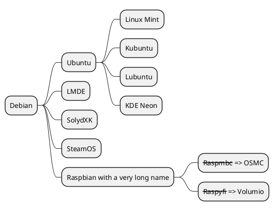
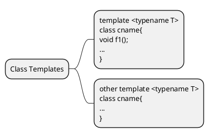
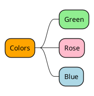
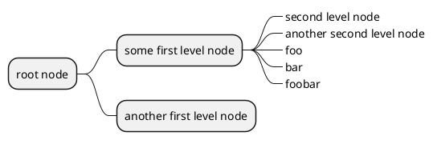
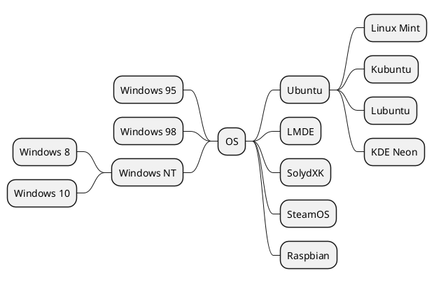
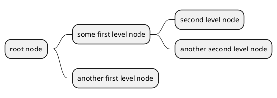
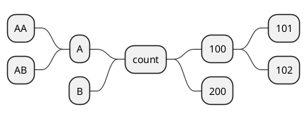
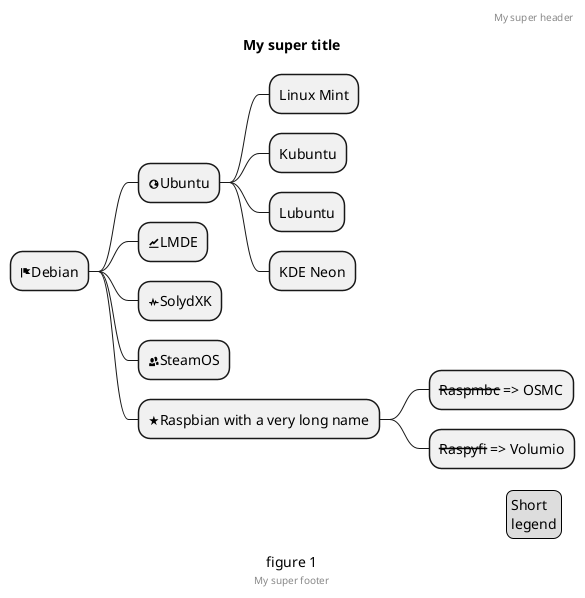

# 第二章 第15节：思维导图

于测试阶段：语法随时可能更改。

## OrgMode 语法

同时兼容OrgMode语法。

```markdown
@startmindmap
* Debian
** Ubuntu
*** Linux Mint
*** Kubuntu
*** Lubuntu
*** KDE Neon
** LMDE
** SolydXK
** SteamOS
** Raspbian with a very long name
*** <s>Raspmbc</s> => OSMC
*** <s>Raspyfi</s> => Volumio
@endmindmap
```



## Multilines

You can use `:` and `;` to have multilines box.

```markdown
@startmindmap
* Class Templates
**:template <typename T>
class cname{
void f1()<U+003B>
...
};
**:other template <typename T>
class cname{
...
};
@endmindmap
```



## Colors

It is possible to change node color.

```markdown
@startmindmap
*[#Orange] Colors
**[#lightgreen] Green
**[#FFBBCC] Rose
**[#lightblue] Blue
@endmindmap
```



## 去除外边框

你可以用下划线去除外边框。

```markdown
@startmindmap
* root node
** some first level node
***_ second level node
***_ another second level node
***_ foo
***_ bar
***_ foobar
** another first level node
@endmindmap
```



## 运算符

你可以使用下面的运算符来决定图形方向。

```markdown
@startmindmap
+ OS
++ Ubuntu
+++ Linux Mint
+++ Kubuntu
+++ Lubuntu
+++ KDE Neon
++ LMDE
++ SolydXK
++ SteamOS
++ Raspbian
-- Windows 95
-- Windows 98
-- Windows NT
--- Windows 8
--- Windows 10
@endmindmap
```



## Markdown语法

同时兼容Markdown语法。

```markdown
@startmindmap
* root node
	* some first level node
		* second level node
		* another second level node
	* another first level node
@endmindmap
```



## 改变图形方向

你可以同时使用图形的左右两侧。

```markdown
@startmindmap
* count
** 100
*** 101
*** 102
** 200

left side

** A
*** AA
*** AB
** B
@endmindmap
```



## 完整示例

```markdown
@startmindmap
caption figure 1
title My super title

* <&flag>Debian
** <&globe>Ubuntu
*** Linux Mint
*** Kubuntu
*** Lubuntu
*** KDE Neon
** <&graph>LMDE
** <&pulse>SolydXK
** <&people>SteamOS
** <&star>Raspbian with a very long name
*** <s>Raspmbc</s> => OSMC
*** <s>Raspyfi</s> => Volumio

header
My super header
endheader

center footer My super footer

legend right
  Short
  legend
endlegend
@endmindmap
```



