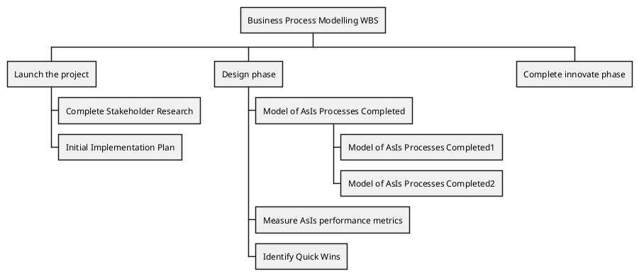
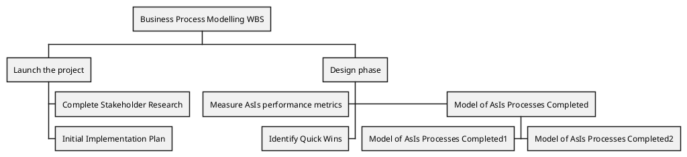
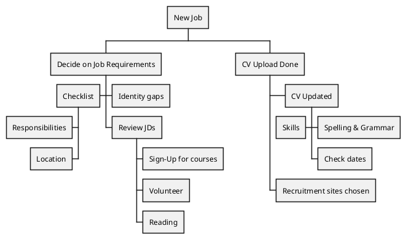
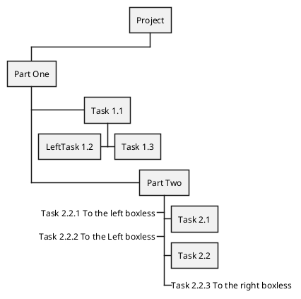

# 第二章 第16节：工作分解结构图

WBS diagram are still in beta: the syntax may change without notice.

## OrgMode syntax

This syntax is compatible with OrgMode

```markdown
@startwbs
* Business Process Modelling WBS
** Launch the project
*** Complete Stakeholder Research
*** Initial Implementation Plan
** Design phase
*** Model of AsIs Processes Completed
**** Model of AsIs Processes Completed1
**** Model of AsIs Processes Completed2
*** Measure AsIs performance metrics
*** Identify Quick Wins
** Complete innovate phase
@endwbs
```



## Change direction

You can change direction using `<` and `>`

```markdown
@startwbs
* Business Process Modelling WBS
** Launch the project
*** Complete Stakeholder Research
*** Initial Implementation Plan
** Design phase
*** Model of AsIs Processes Completed
****< Model of AsIs Processes Completed1
****> Model of AsIs Processes Completed2
***< Measure AsIs performance metrics
***< Identify Quick Wins
@endwbs
```



## Arithmetic notation

You can use the following notation to choose diagram side.

```markdown
@startwbs
+ New Job
++ Decide on Job Requirements
+++ Identity gaps
+++ Review JDs
++++ Sign-Up for courses
++++ Volunteer
++++ Reading
++- Checklist
+++- Responsibilities
+++- Location
++ CV Upload Done
+++ CV Updated
++++ Spelling & Grammar
++++ Check dates
---- Skills
+++ Recruitment sites chosen
@endwbs
```



You can use underscore `_` to remove box drawing.

```markdown
@startwbs
+ Project
 + Part One
  + Task 1.1
   - LeftTask 1.2
   + Task 1.3
  + Part Two
   + Task 2.1
   + Task 2.2
   -_ Task 2.2.1 To the left boxless
   -_ Task 2.2.2 To the Left boxless
   +_ Task 2.2.3 To the right boxless
@endwbs
```



