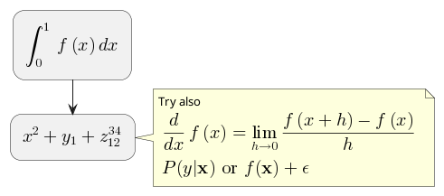
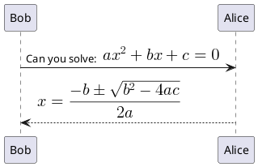
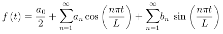
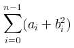

# 第二章 第17节：数学公式

## 简介

您可以在PlantUML中用[AsciiMath](http://asciimath.org/) 或[JLaTeXMath](https://github.com/opencollab/jlatexmath) 符号:

```markdown
@startuml
:<math>int_0^1f(x)dx</math>;
:<math>x^2+y_1+z_12^34</math>;
note right
Try also
<math>d/dxf(x)=lim_(h->0)(f(x+h)-f(x))/h</math>
<latex>P(y|\mathbf{x}) \mbox{ or } f(\mathbf{x})+\epsilon</latex>
end note
@enduml
```



或:

```markdown
@startuml
Bob -> Alice : Can you solve: <math>ax^2+bx+c=0</math>
Alice --> Bob: <math>x = (-b+-sqrt(b^2-4ac))/(2a)</math>
@enduml
```



## 独立图

您也可以用 `@startmath`/`@endmath` 来创建独立的 [AsciiMath](http://asciimath.org/) 公式。

```markdown
@startmath
f(t)=(a_0)/2 + sum_(n=1)^ooa_ncos((npit)/L)+sum_(n=1)^oo b_n\ sin((npit)/L)
@endmath
```



或用 `@startlatex`/`@endlatex` 来创建独立的 [JLaTeXMath](https://github.com/opencollab/jlatexmath) 公式。

```markdown
@startlatex
\sum_{i=0}^{n-1} (a_i + b_i^2)
@endlatex
```



## 这是如何工作的 ?

要绘制这此公式, PlantUML 使用了两个开源项目：  

- [AsciiMath](https://github.com/asciimath/asciimathml/tree/master/asciimath-based) 转换 AsciiMath 符号为 LaTeX 表达式。
- [JLatexMath](https://github.com/opencollab/jlatexmath) 来显示LaTex 数学公式。 JLaTeXMath 是最好的显示LaTeX代码的 Java 类库。  

[ASCIIMathTeXImg.js](https://github.com/asciimath/asciimathml/blob/master/asciimath-based/ASCIIMathTeXImg.js) 是一个小到足以集成到 PlantUML 标准发版的。  

由于 [JLatexMath](https://github.com/opencollab/jlatexmath) 太大, 您要单独到 [下载它](http://beta.plantuml.net/plantuml-jlatexmath.zip), 然后解压 4 jar 文件 (*batik-all-1.7.jar*, *jlatexmath-minimal-1.0.3.jar*, *jlm_cyrillic.jar* 和 *jlm_greek.jar*) 到 PlantUML.jar同一目录下。