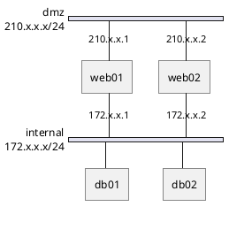
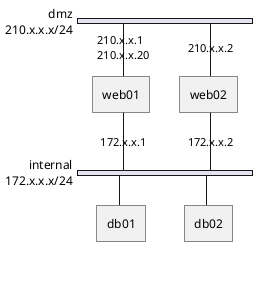
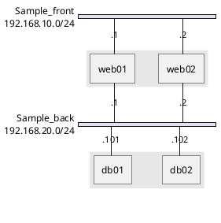
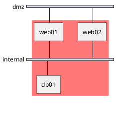
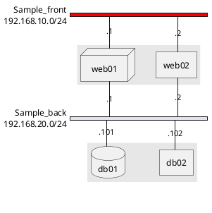
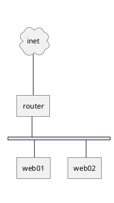

# 第二章 第19节：nwdiag

[nwdiag](http://blockdiag.com/en/nwdiag/nwdiag-examples.html) has been created by [Takeshi Komiya](https://twitter.com/tk0miya) and allows to quickly draw network diagrams. So we thank him for his creation!  

Since the syntax is clear and simple, this has been integrated within PlantUML. We reuse here the examples that Takeshi has documented.  

## Simple diagram

```markdown
@startuml
nwdiag {
  network dmz {
      address = "210.x.x.x/24"

      web01 [address = "210.x.x.1"];
      web02 [address = "210.x.x.2"];
  }
  network internal {
      address = "172.x.x.x/24";

      web01 [address = "172.x.x.1"];
      web02 [address = "172.x.x.2"];
      db01;
      db02;
  }
}
@enduml
```



## define multiple addresses

```markdown
@startuml
nwdiag {
  network dmz {
      address = "210.x.x.x/24"

      // set multiple addresses (using comma)
      web01 [address = "210.x.x.1, 210.x.x.20"];
      web02 [address = "210.x.x.2"];
  }
  network internal {
      address = "172.x.x.x/24";

      web01 [address = "172.x.x.1"];
      web02 [address = "172.x.x.2"];
      db01;
      db02;
  }
}
@enduml
```



## grouping nodes

Not fully implemented yet

```markdown
@startuml
nwdiag {
  network Sample_front {
    address = "192.168.10.0/24";

    // define group
    group web {
      web01 [address = ".1"];
      web02 [address = ".2"];
    }
  }
  network Sample_back {
    address = "192.168.20.0/24";
    web01 [address = ".1"];
    web02 [address = ".2"];
    db01 [address = ".101"];
    db02 [address = ".102"];

    // define network using defined nodes
    group db {
      db01;
      db02;
    }
  }
}
@enduml
```



```markdown
@startuml
nwdiag {
  // define group at outside network definitions
  group {
    color = "#FF7777";

    web01;
    web02;
    db01;
  }

  network dmz {
    web01;
    web02;
  }
  network internal {
    web01;
    web02;
    db01;
  }
}
@enduml
```



## Extended Syntax

```markdown
@startuml
nwdiag {
  network Sample_front {
    address = "192.168.10.0/24"
    color = "red"

    // define group
    group web {
      web01 [address = ".1", shape = "node"]
      web02 [address = ".2"]
    }
  }
  network Sample_back {
    address = "192.168.20.0/24"
    web01 [address = ".1"]
    web02 [address = ".2"]
    db01 [address = ".101", shape = database ]
    db02 [address = ".102"]

    // define network using defined nodes
    group db {
      db01;
      db02;
    }
  }
}
@enduml
```



## peer networks

```markdown
@startuml
nwdiag {
  inet [shape = cloud];
  inet -- router;

  network {
    router;
    web01;
    web02;
  }
}
@enduml
```



