# 第二章 第2节：用例图

Let's have few examples :  
Note that you can disable the shadowing using the `skinparam shadowing false` command.

## 用例

用例用圆括号括起来。  
也可以用关键字`usecase`来定义用例。 还可以用关键字`as`定义一个别名，这个别名可以在以后定义关系的时候使用。  
```markdown
@startuml

(First usecase)
(Another usecase) as (UC2)
usecase UC3
usecase (Last\nusecase) as UC4

@enduml
```

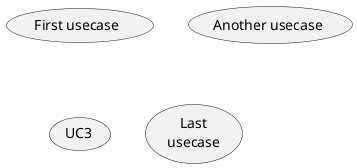

## 角色

角色用两个冒号包裹起来。  
也可以用`actor`关键字来定义角色。 还可以用关键字`as`来定义一个别名，这个别名可以在以后定义关系的时候使用。  
后面我们会看到角色的定义是可选的。  
```markdown
@startuml

:First Actor:
:Another\nactor: as Men2
actor Men3
actor :Last actor: as Men4

@enduml
```

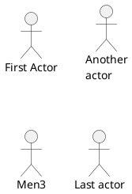

## 用例描述

如果想定义跨越多行的用例描述，可以用双引号将其裹起来。  
还可以使用这些分隔符：`--``..``==``__`。 并且还可以在分隔符中间放置标题。  
```markdown
@startuml

usecase UC1 as "You can use
several lines to define your usecase.
You can also use separators.
--
Several separators are possible.
==
And you can add titles:
..Conclusion..
This allows large description."

@enduml
```

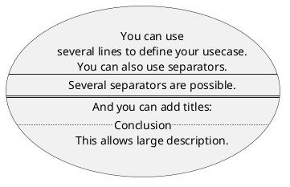

## Use package

You can use packages to group actors or use cases.  
```markdown
@startuml
left to right direction
actor "Food Critic" as fc
package Restaurant {
  usecase "Eat Food" as UC1
  usecase "Pay for Food" as UC2
  usecase "Drink" as UC3
}
fc --> UC1
fc --> UC2
fc --> UC3
@enduml
```

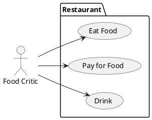

You can use `rectangle` to change the display of the package.

```markdown
@startuml
left to right direction
actor "Food Critic" as fc
rectangle Restaurant {
  usecase "Eat Food" as UC1
  usecase "Pay for Food" as UC2
  usecase "Drink" as UC3
}
fc --> UC1
fc --> UC2
fc --> UC3
@enduml
```

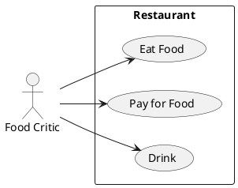

## 基础示例

用箭头`-->`连接角色和用例。  
横杠`-`越多，箭头越长。 通过在箭头定义的后面加一个冒号及文字的方式来添加标签。  
在这个例子中，*User*并没有定义，而是直接拿来当做一个角色使用。  
```markdown
@startuml

User -> (Start)
User --> (Use the application) : A small label

:Main Admin: ---> (Use the application) : This is\nyet another\nlabel

@enduml
```

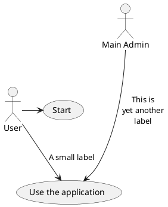

## 继承

如果一个角色或者用例继承于另一个，那么可以用`<|--`符号表示。

```markdown
@startuml
:Main Admin: as Admin
(Use the application) as (Use)

User <|-- Admin
(Start) <|-- (Use)

@enduml
```

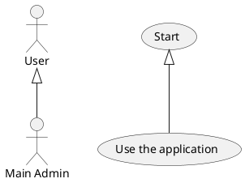

## 使用注释

可以用`note left of` , `note right of` , `note top of` , `note bottom of`等关键字给一个对象添加注释。  
注释还可以通过`note`关键字来定义，然后用`..`连接其他对象。  

```markdown
@startuml
:Main Admin: as Admin
(Use the application) as (Use)

User -> (Start)
User --> (Use)

Admin ---> (Use)

note right of Admin : This is an example.

note right of (Use)
  A note can also
  be on several lines
end note

note "This note is connected\nto several objects." as N2
(Start) .. N2
N2 .. (Use)
@enduml
```

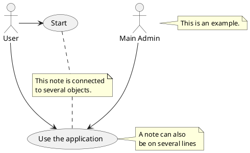

## 构造类型

用 `<<` 和 `>>` 来定义角色或者用例的构造类型。

```markdown
@startuml
User << Human >>
:Main Database: as MySql << Application >>
(Start) << One Shot >>
(Use the application) as (Use) << Main >>

User -> (Start)
User --> (Use)

MySql --> (Use)

@enduml
```

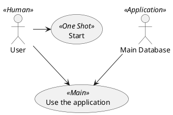

## 改变箭头方向

默认连接是竖直方向的，用`--`表示，可以用一个横杠或点来表示水平连接。

```markdown
@startuml
:user: --> (Use case 1)
:user: -> (Use case 2)
@enduml
```

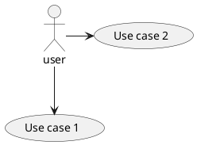

也可以通过翻转箭头来改变方向。

```markdown
@startuml
(Use case 1) <.. :user:
(Use case 2) <- :user:
@enduml
```

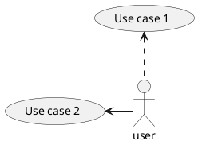

还可以通过给箭头添加`left`, `right`, `up`或`down`等关键字来改变方向。

```markdown
@startuml
:user: -left-> (dummyLeft)
:user: -right-> (dummyRight)
:user: -up-> (dummyUp)
:user: -down-> (dummyDown)
@enduml
```

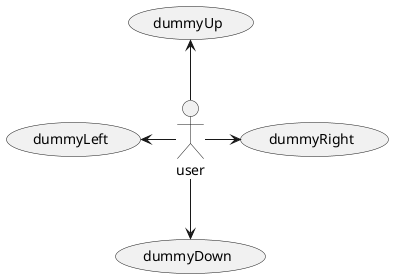
这些方向关键字也可以只是用首字母或者前两个字母的缩写来代替。  
但是请注意，这样的缩写不要乱用，Graphviz不喜欢这样。  

## 分割图示

用`newpage`关键字将图示分解为多个页面。

```markdown
@startuml
:actor1: --> (Usecase1)
newpage
:actor2: --> (Usecase2)
@enduml
```

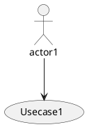

## 从左向右方向

默认从上往下构建图示。

```markdown
@startuml
'default
top to bottom direction
user1 --> (Usecase 1)
user2 --> (Usecase 2)

@enduml
```

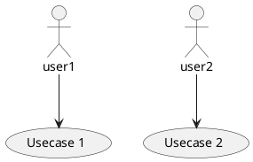

你可以用`left to right direction`命令改变图示方向。

```markdown
@startuml

left to right direction
user1 --> (Usecase 1)
user2 --> (Usecase 2)

@enduml
```

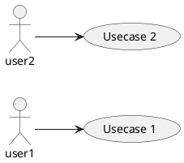

## 显示参数

用[skinparam](https://plantuml.com/zh/skinparam)改变字体和颜色。  
可以在如下场景中使用：  
- 在图示的定义中，
- [在引入的文件中](https://plantuml.com/zh/preprocessing)，
- 在[命令行](https://plantuml.com/zh/command-line)或者[ANT任务](https://plantuml.com/zh/ant-task)提供的配置文件中。  

你也可以给构造的角色和用例指定特殊颜色和字体。  

```markdown
@startuml
skinparam handwritten true

skinparam usecase {
BackgroundColor DarkSeaGreen
BorderColor DarkSlateGray

BackgroundColor<< Main >> YellowGreen
BorderColor<< Main >> YellowGreen

ArrowColor Olive
ActorBorderColor black
ActorFontName Courier

ActorBackgroundColor<< Human >> Gold
}

User << Human >>
:Main Database: as MySql << Application >>
(Start) << One Shot >>
(Use the application) as (Use) << Main >>

User -> (Start)
User --> (Use)

MySql --> (Use)

@enduml
```

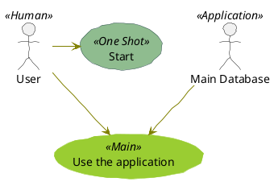

## 一个完整的例子

```markdown
@startuml
left to right direction
skinparam packageStyle rectangle
actor customer
actor clerk
rectangle checkout {
  customer -- (checkout)
  (checkout) .> (payment) : include
  (help) .> (checkout) : extends
  (checkout) -- clerk
}
@enduml
```

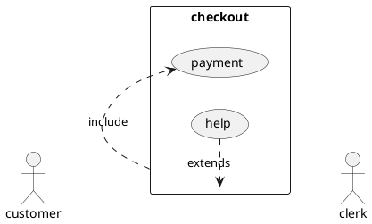

