# 第二章 第20节：PlantUML绘制23种设计模式

参考链接：

* 设计模式概念`含结构说明`: http://c.biancheng.net/view/1317.html
* 设计模式概念`丰富`: https://www.runoob.com/design-pattern/design-pattern-tutorial.html
* 设计模式概念`描述不一致`: https://blog.csdn.net/zxh2075/article/details/80164113
* 设计模式`PlantUML`: https://blog.csdn.net/u010144805/article/details/82415385
* 设计模式`C++`: https://gitee.com/micooz/DesignPattern
* 设计模式`C++`: https://github.com/micooz/DesignPattern
* 类的关系: https://www.cnblogs.com/pangjianxin/p/7877868.html
* 类的关系: https://www.cnblogs.com/qianpangzi/p/10842672.html

UML类图几种关系的总结  
`泛化` 实线三角指向父类；  
`实现` 虚线三角指向接口；  

`组合` 实心菱形精密关联不可分，是组合；  
`聚合` 空心菱形能分离而独立存在，是聚合；  

`关联` 实线箭头指向关联，箭头代表`拥有`，箭头指向被拥有者；  
`依赖` 虚线箭头指向依赖；  

各种关系的强弱顺序：  
`泛化= 实现> 组合> 聚合> 关联> 依赖`

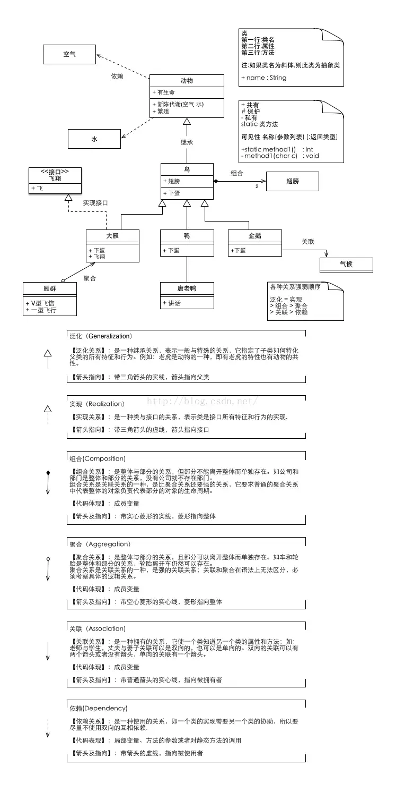

## 单例模式(Singleton pattern)

单例模式(Singleton pattern): 确保一个类只有一个实例, 并提供全局访问点.

```markdown
@startuml
skinparam classAttributeIconSize 0

package "class Singleton(单例模式)" #DDDDDD {

    class Singleton
    {
    +getInstance():Singleton
    -Singleton()
    }
    note right: 单例类

    Singleton <.. Client
}
@enduml
```

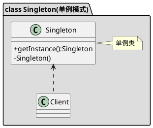

## 生成器模式(Builder pattern)

使用生成器模式封装一个产品的构造过程, 并允许按步骤构造. 将一个复杂对象的构建与它的表示分离, 使得同样的构建过程可以创建不同的表示.

```markdown
@startuml
skinparam classAttributeIconSize 0

package "class Builder(生成器模式)" #DDDDDD {
    abstract class Builder
    {
    +buildPartA():void
    +buildPartB():void
    +buildPartC():void
    }
    note right: 抽象Builder类

    class ConcreteBuilder
    {
    +buildPartA():void
    +buildPartB():void
    +buildPartC():void
    }
    note right: 具体Builder类

    class Director
    {
    +construct()
    }
    note right:统一组装过程

    abstract class Product
    note right:产品的抽象类

    Director o-- Builder
    Builder <|-- ConcreteBuilder
    Product <.. ConcreteBuilder:<<use>>
}
@enduml
```

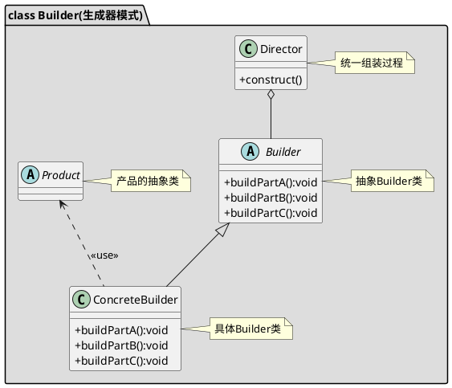

## 原型模式(prototype pattern)

当创建给定类的实例过程很昂贵或很复杂时, 就使用原形模式.

```markdown
@startuml
skinparam classAttributeIconSize 0

package "class Protype(原型模式)" #DDDDDD {
    class Protype<< (A,#FF7700) interface>>
    {
    +clone()
    }
    note right: 原型的抽象类或接口

    class ConcreteProtype
    {
    +clone()
    }
    note right: 具体的原型类

    Protype <|.. ConcreteProtype
    Client ..> Protype:<<import>>
}
@enduml
```

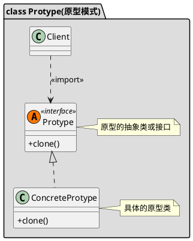

## 工厂方法模式(factorymethod pattern)

定义了一个创建对象的接口, 但由子类决定要实例化的类是哪一个. 工厂方法让类把实例化推迟到子类.

```markdown
@startuml
skinparam classAttributeIconSize 0

package "class FactoryMethod(工厂方法模式)" #DDDDDD {
    abstract class Factory
    {
    +createProduct():Product
    }

    class ConcreteFactory
    {
    +createProduct():Product
    }

    abstract class Product
    {
    +method():void
    }

    class ConcreteProduct
    {
    +method():void
    }

    Product <|-- ConcreteProduct
    Factory <|-- ConcreteFactory
    ConcreteProduct <.. ConcreteFactory
}
@enduml
```

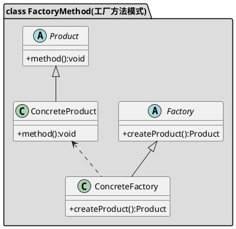

## 抽象工厂模式(Abstractfactory pattern)

提供一个接口, 用于创建相关或依赖对象的家族, 而不需要指定具体类.

```markdown
@startuml
skinparam classAttributeIconSize 0

package "class AbstractFactory(抽象工厂模式)" #DDDDDD {
    abstract class AbstractProductA
    {
    +method():void
    }

    abstract class AbstractProductB
    {
    +method():void
    }

    class ConcreteProductA1
    {
    +method():void
    }

    class ConcreteProductA2
    {
    +method():void
    }

    class ConcreteProductB1
    {
    +method():void
    }

    class ConcreteProductB2
    {
    +method():void
    }

    abstract class AbstractFactory
    {
    +createProductA():AbstractProductA
    +createProductB():AbstractProductB
    }
    note top of AbstractFactory: 抽象工厂

    class ConcreteFactory1
    {
    +createProductA():AbstractProductA
    +createProductB():AbstractProductB
    }

    class ConcreteFactory2
    {
    +createProductA():AbstractProductA
    +createProductB():AbstractProductB
    }

    AbstractProductA <|-- ConcreteProductA1
    AbstractProductA <|-- ConcreteProductA2
    AbstractProductB <|-- ConcreteProductB1
    AbstractProductB <|-- ConcreteProductB2
    AbstractFactory <|-- ConcreteFactory1
    AbstractFactory <|-- ConcreteFactory2
    ConcreteFactory1 ..> ConcreteProductA1
    ConcreteFactory1 ..> ConcreteProductB1
    ConcreteFactory2 ..> ConcreteProductA2
    ConcreteFactory2 ..> ConcreteProductB2
}
@enduml
```

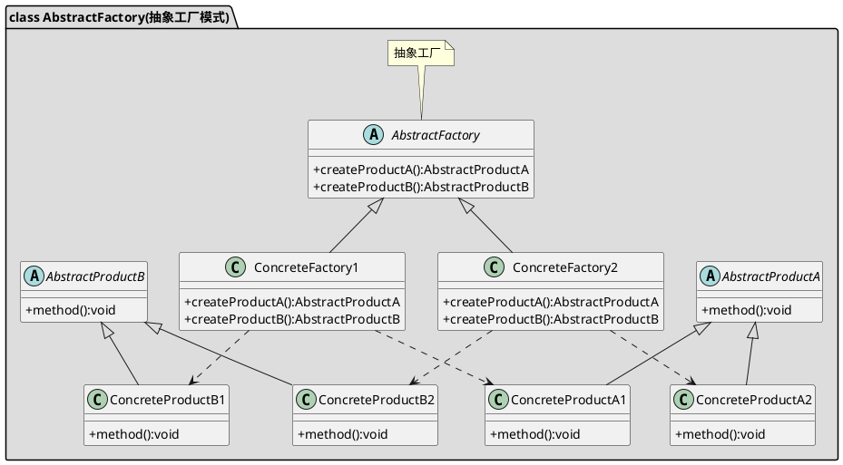

## 代理模式(Proxy pattern)

为另一个对象提供一个替身或占位符以控制对这个对象的访问.

```markdown
@startuml
skinparam classAttributeIconSize 0

package "class Proxy(代理模式)" #DDDDDD {
    class Client

    abstract class Subject
    {
    +visit()
    }
    note right: 抽象主题类

    class RealSubject
    {
    +visit()
    }
    note right: 真实主题类

    class ProxySubject{
    -mSubject:RealSubject
    +visit()
    }
    note right: 代理类

    Subject <.. Client
    Subject <|-- RealSubject
    Subject <|-- ProxySubject
    RealSubject <-- ProxySubject
}
@enduml
```

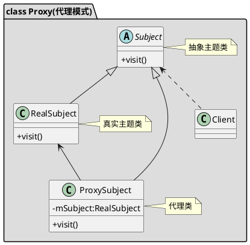

## 适配器模式(Adapter pattern)

将一个类的接口, 转换成客户期望的另一个接口. 适配器让原本接口不兼容的类可以合作无间. 对象适配器使用组合, 类适配器使用多重继承.

```markdown
@startuml
skinparam classAttributeIconSize 0

package "class Adapter(适配器模式)" #DDDDDD {
    class Target<< (I,#FF7700) Interface>>{
    +operation1()
    +operation2():void
    }
    note right: 目标

    class Adapter{
    + operation2()
    }
    note right: 适配器

    class Adaptee{
    + operation3()
    }
    note right: 需要适配的接口

    Target <|.. Adapter
    Adaptee <|-- Adapter
}
@enduml
```

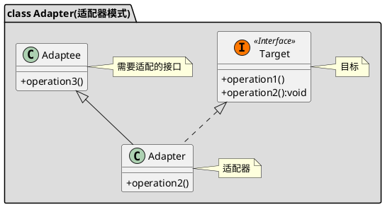

## 组合模式(composite pattern)

允许你将对象组合成树形结构来表现"整体/部分"层次结构. 组合能让客户以一致的方式处理个别对象以及对象组合.

```markdown
@startuml
skinparam classAttributeIconSize 0

package "class Composite(组合模式)" #DDDDDD {
    class Client

    abstract class Component{
    #name:String
    +Component(String):void
    +doSomething():void
    }

    class Leaf{
    +Component(String):void
    +doSomething():void
    }

    class Composite{
    -components:List<Component>
    +Component(String):void
    +doSomething():void
    +addChild(Component):void
    +getChildren(int):Component
    +removeChild(Component):void
    }

    Component <-- Client
    Component <|-- Leaf
    Component <|-- Composite
    Component <--o Composite
}
@enduml
```

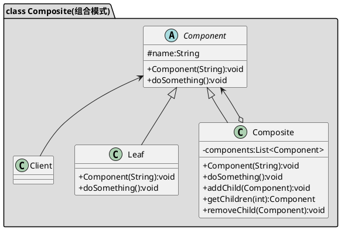

## 装饰者模式(decorator pattern)

动态地将责任附加到对象上, 若要扩展功能, 装饰者提供了比继承更有弹性的替代方案.

```markdown
@startuml
skinparam classAttributeIconSize 0

package "class Decorator(装饰模式)" #DDDDDD {

    abstract class Component
    {
    + operate():void
    }
    note top of Component: 抽象组件

    class ConcreteComponent
    {
    + operate():void
    }
    note top of ConcreteComponent: 组件具体实现类

    abstract class Decorator
    {
    - component:Component
    + Decorator(Component)
    + operate():void
    }
    note left: 抽象类装饰者

    class ConreteDecoratorA
    {
    + ConreteDecoratorA(Component)
    + operate():void
    + operateA():void
    + operateB():void
    }

    class ConreteDecoratorB
    {
    + ConreteDecoratorB(Component)
    + operate():void
    + operateA():void
    + operateB():void
    }

    Component <|-- ConcreteComponent
    Component <|-- Decorator
    Component <--o Decorator
    ConreteDecoratorA --|> Decorator
    ConreteDecoratorB --|> Decorator
}
@enduml
```

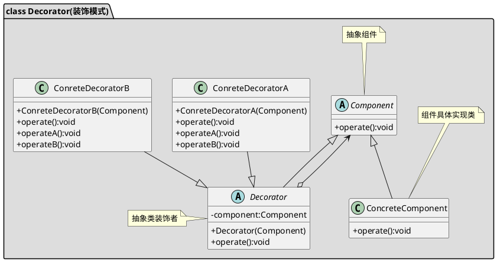

## 享元模式(FlyweightPattern)

如想让某个类的一个实例能用来提供许多"虚拟实例", 就使用享元模式.

```markdown
@startuml
skinparam classAttributeIconSize 0

package "class Flyweight(享元模式)" #DDDDDD {
    class FlyweightFactory{
    - mMap:HashMap
    + getFlyweight()
    }
    note right: 享元工厂

    class Flyweight{
    + dosomething()
    }
    note right: 享元对象抽象基类或者接口

    class ConcreteFlyweight{
    - intrinsicState:String
    + dosomething()
    }
    note right: 具体的享元对象

    FlyweightFactory *-- Flyweight
    Flyweight <|-- ConcreteFlyweight
}
@enduml
```

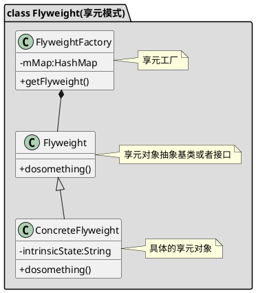

## 外观模式(facade pattern)

提供了一个统一的接口, 用来访问子系统中的一群接口. 外观定义了一个高层接口, 让子系统更容易使用.

```markdown
@startuml
skinparam classAttributeIconSize 0

package "class Facade(外观模式)" #DDDDDD {
    class Facade{
    + operationA()
    + operationB():void
    + operationC():void
    }
    note right: 系统对外的统一接口

    class SystemA << (I,#FF7700) Interface>>
    class SystemB << (I,#FF7700) Interface>>
    class SystemC << (I,#FF7700) Interface>>
    Facade --> SystemA:<<use>>
    Facade --> SystemB:<<use>>
    Facade --> SystemC:<<use>>
}
@enduml
```

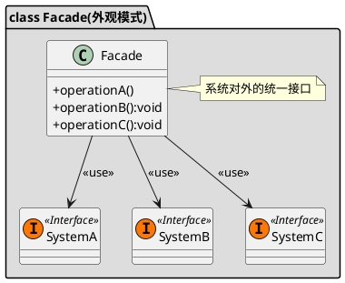

## 桥接模式(Bridge pattern)

使用桥接模式通过将实现和抽象放在两个不同的类层次中而使它们可以独立改变.

```markdown
@startuml
skinparam classAttributeIconSize 0

package "class Bridge(桥接模式)" #DDDDDD {

    abstract class Abstraction
    Abstraction : +operation()
    note right: 抽象部分

    class RefinedAbstraction
    note top of RefinedAbstraction:优化的抽象部分

    interface Implementor
    Implementor : +operationImpl()
    note right:实现部分

    class Client
    note right : 客户端

    ConcreteImplementorA : +operationImpl()

    ConcreteImplementorB : +operationImpl()

    Client --> Abstraction
    RefinedAbstraction --|> Abstraction
    Implementor --o Abstraction
    ConcreteImplementorA ..|> Implementor
    ConcreteImplementorB ..|> Implementor
}
@enduml
```

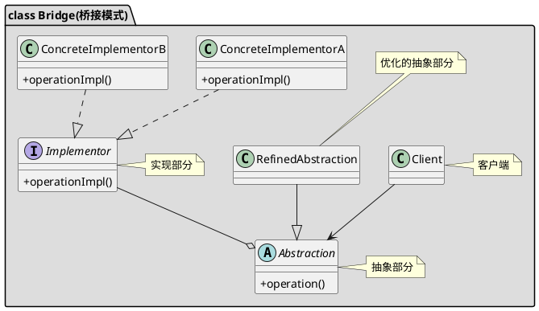

## 策略模式(strategy pattern)

定义了算法族, 分别封闭起来, 让它们之间可以互相替换, 此模式让算法的变化独立于使用算法的客户.

```markdown
@startuml
skinparam classAttributeIconSize 0

package "class Strategy(策略模式)" #DDDDDD {
    interface Strategy
    {
    +algorithm()
    }
    note right: 策略的抽象

    class ConcreteStrategyA
    {
    +algorithm()
    }

    class ConcreteStrategyB
    {
    +algorithm()
    }

    class Context
    {
    +setStrategy(Strategy)
    +algorithm()
    }
    note right:上下文环境

    Context o-- Strategy
    Strategy <|.. ConcreteStrategyA
    Strategy <|.. ConcreteStrategyB
}
@enduml
```

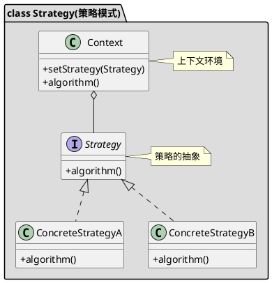

## 状态模式(State pattern)

允许对象在内部状态改变时改变它的行为, 对象看起来好象改了它的类.

```markdown
@startuml
skinparam classAttributeIconSize 0

package "class State(状态模式)" #DDDDDD {
    interface State
    {
    +doSomething():void
    }
    note right: 抽象状态类或状态接口

    class ConcreteStateA
    {
    +doSomething():void
    }

    class ConcreteStateB
    {
    +doSomething():void
    }

    class Context
    {
    +addState(State)
    +doSomething():void
    }
    note right:环境类

    Context -- State
    State <|.. ConcreteStateA
    State <|.. ConcreteStateB
}
@enduml
```

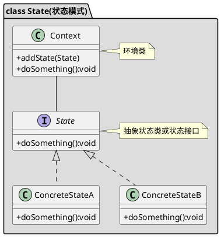

## 责任链模式(Chainofresponsibility pattern)

通过责任链模式, 你可以为某个请求创建一个对象链. 每个对象依序检查此请求并对其进行处理或者将它传给链中的下一个对象.

```markdown
@startuml
skinparam classAttributeIconSize 0

package "class ChainOfResponsibility(责任链模式)" #DDDDDD {
    abstract class Handler
    {
    #successor():Handler
    +handleRequest(String):void
    }
    note left: 抽象处理者

    class ConcreteHandler1
    {
    +handleRequest(String):void
    }

    class ConcreteHandler2
    {
    +handleRequest(String):void
    }

    Handler o-- Handler:0..1
    Handler <|-- ConcreteHandler1
    Handler <|-- ConcreteHandler2
    Client ..> Handler
}
@enduml
```

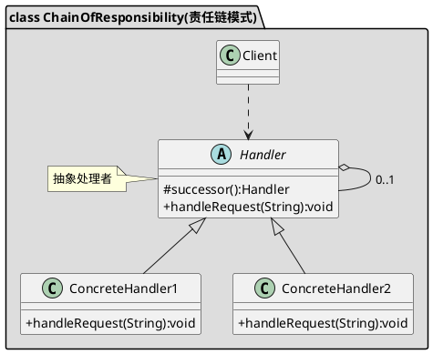

## 解释器模式(Interpreter pattern)

使用解释器模式为语言创建解释器.

```markdown
@startuml
skinparam classAttributeIconSize 0

package "class Interpreter(解释器模式)" #DDDDDD {
    abstract class AbstractExpression
    {
    +interpret(context)
    }
    note top of AbstractExpression: 抽象表达式

    class TerminalExpression
    {
    +interpret(context)
    }
    note bottom of TerminalExpression: 终结符表达式

    class NonTerminalExpression
    {
    +interpret(context)
    }
    note bottom of NonTerminalExpression: 非终结符表达式

    class Context
    note top of Context: 上下文

    AbstractExpression <--o NonTerminalExpression
    AbstractExpression<|-- NonTerminalExpression
    AbstractExpression <|-- TerminalExpression
    AbstractExpression <-- Client
    Context <-- Client
}
@enduml
```

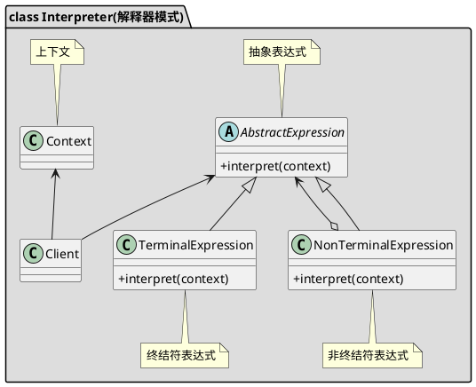

## 命令模式(Command pattern)

将"请求"封闭成对象, 以便使用不同的请求,队列或者日志来参数化其他对象. 命令模式也支持可撤销的操作.

```markdown
@startuml
skinparam classAttributeIconSize 0

package "class Comand(命令模式)" #DDDDDD {
    class Invoker
    {
    -comand:Comand
    +Invoker(Comand)
    +action():void
    }
    note right: 请求者

    class Receiver
    {
    -comand:Comand
    +action():void
    }
    note right: 接收者

    class Comand<< (I,#FF7700) interface>>
    {
    +execute():void
    }
    note right: 命令

    class ConcreteComand
    {
    -receiver:Receiver
    +ConcreteComand(Comand)
    +execute():void
    }
    note right: 具体命令

    Client..>Invoker
    Client..>Receiver
    Invoker o--> Comand
    Receiver <-- ConcreteComand
    Comand <|.. ConcreteComand
}
@enduml
```

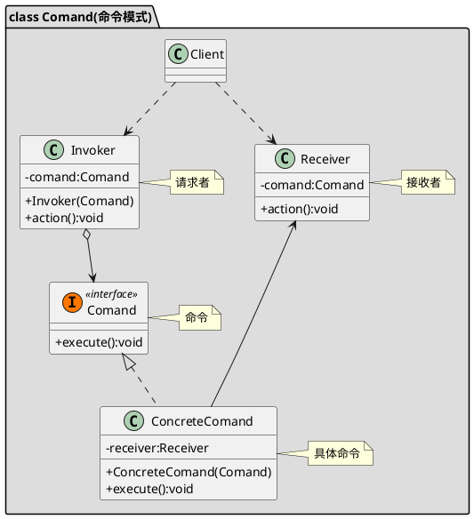

## 观察者模式(observer pattern)

在对象之间定义一对多的依赖, 这样一来, 当一个对象改变状态, 依赖它的对象都会收到通知, 并自动更新.

```markdown
@startuml
skinparam classAttributeIconSize 0

package "class Observer(观察者模式)" #DDDDDD {
    class Subject<< (A,#FF7700) abstract>>
    {
    +notifyObservers(Object)
    }
    note right: 抽象主题

    class ConcreteSubject
    {
    +notifyObservers(Object)
    }
    note right: 具体主题

    class Observer<< (I,#FF7700) interface>>
    {
    +update(Object)
    }
    note right: 抽象观察者

    class ConcreteObserver
    {
    +update(Object)
    }
    note right: 具体观察者

    Subject <|-- ConcreteSubject
    Subject "1" o-- "0..*" Observer
    Observer <|.. ConcreteObserver
}
@enduml
```

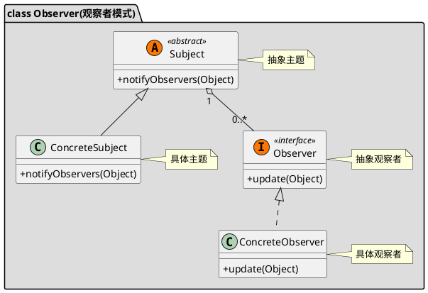

## 备忘录模式(Memento pattern)

当你需要让对象返回之前的状态时(例如, 你的用户请求"撤销"), 你使用备忘录模式.

```markdown
@startuml
skinparam classAttributeIconSize 0

package "class Memento(备忘录模式)" #DDDDDD {

    class Originator
    {
    +restore(Memento)
    +createMemento():Memento
    }
    note right: 负责创建备忘录

    class Memento
    {
    -mState
    +setState(int)
    +getState():int
    }
    note right: 备忘录

    class Caretaker
    {
    -mMemento:Memento
    +restoreMemento():Memento
    +storeMemento(Memento):void
    }
    note right:负责存储备忘录

    Originator ..> Memento
    Memento --o Caretaker
}
@enduml
```

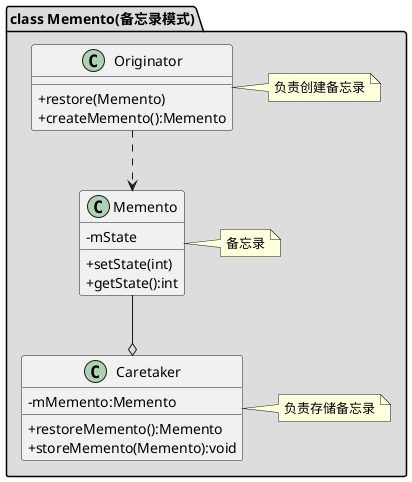

## 迭代器模式(iterator pattern)

提供一种方法顺序访问一个聚合对象中的各个元素, 而又不暴露其内部的表示.

```markdown
@startuml
skinparam classAttributeIconSize 0

package "class Iterator(迭代器模式)" #DDDDDD {
    class Iterator<< (I,#FF7700) interface>>{
    +next():Object
    +hasNext():boolean
    }
    note right: 迭代器接口

    class ConcreteIterator{
    +next():Object
    +hasNext():boolean
    }
    note right: 具体迭代器类

    class Aggregate<< (I,#FF7700) interface>>{
    +add(Object):void
    +remove(Object):void
    +iterator():Iterator
    }
    note right: 容器接口

    class ConcreteAggregate{
    +add(Object):void
    +remove(Object):void
    +iterator():Iterator
    }
    note right: 具体容器类

    Iterator <|.. ConcreteIterator
    Iterator o-- Aggregate
    Aggregate <|.. ConcreteAggregate
}
@enduml
```

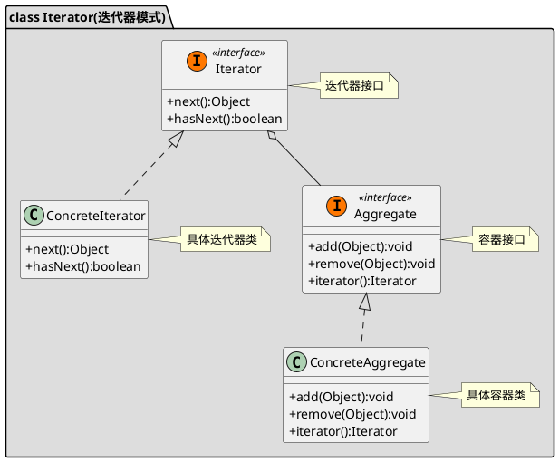

## 模板方法模式(Template pattern)

在一个方法中定义一个算法的骨架, 而将一些步骤延迟到子类中. 模板方法使得子类可以在不改变算法结构的情况下, 重新定义算法中的某些步骤.

```markdown
@startuml
skinparam classAttributeIconSize 0

package "class Template(模板方法模式)" #DDDDDD {
    class AbsTemplate<< (A,#FF7700) abstract>>{
    #stepOne():void
    #stepTwo():void
    #stepThree():void
    +execute():void
    }
    note right: 定义算法框架的抽象类

    class ConcreteImplA
    note right: 具体实现类A

    class ConcreteImplB
    note right: 具体实现类B

    AbsTemplate <|-- ConcreteImplA
    AbsTemplate <|-- ConcreteImplB
}
@enduml
```

```plantuml
@startuml
skinparam classAttributeIconSize 0

package "class Template(模板方法模式)" #DDDDDD {
    class AbsTemplate<< (A,#FF7700) abstract>>{
    #stepOne():void
    #stepTwo():void
    #stepThree():void
    +execute():void
    }
    note right: 定义算法框架的抽象类

    class ConcreteImplA
    note right: 具体实现类A

    class ConcreteImplB
    note right: 具体实现类B

    AbsTemplate <|-- ConcreteImplA
    AbsTemplate <|-- ConcreteImplB
}
@enduml
```

## 访问者模式(visitor pattern)

当你想要为一个对象的组合增加新的能力, 且封装并不重要时, 就使用访问者模式.

```markdown
@startuml
skinparam classAttributeIconSize 0

package "class Visitor(访问者模式)" #DDDDDD {
    class Visitor<< (I,#FF7700) abstract>>
    {
    +visitElementA(ElementA):void
    +visitElementB(ElementB):void
    }
    note top of Visitor: 访问者接口或抽象类

    class ConcreteVisitorA
    {
    +visitElementA(ElementA):void
    +visitElementB(ElementB):void
    }

    class ConcreteVisitorB
    {
    +visitElementA(ElementA):void
    +visitElementB(ElementB):void
    }

    class Element<< (I,#FF7700) abstract>>
    {
    +accept(Visitor)
    }
    note top of Element: 元素接口或抽象类

    class ElementA
    {
    +accept(Visitor)
    +operationA()
    }

    class ElementB
    {
    +accept(Visitor)
    +operationB()
    }

    class ObjectStructure
    note bottom of ObjectStructure: 管理元素集合的对象结构

    class Client

    Visitor <|-- ConcreteVisitorA
    Visitor <|-- ConcreteVisitorB
    Element <|-- ElementA
    Element <|-- ElementB
    Element --o ObjectStructure
    Client ..> Visitor:<<use>>
    Client ..> ObjectStructure:<<use>>

}
@enduml
```

```plantuml
@startuml
skinparam classAttributeIconSize 0

package "class Visitor(访问者模式)" #DDDDDD {
    class Visitor<< (I,#FF7700) abstract>>
    {
    +visitElementA(ElementA):void
    +visitElementB(ElementB):void
    }
    note top of Visitor: 访问者接口或抽象类

    class ConcreteVisitorA
    {
    +visitElementA(ElementA):void
    +visitElementB(ElementB):void
    }

    class ConcreteVisitorB
    {
    +visitElementA(ElementA):void
    +visitElementB(ElementB):void
    }

    class Element<< (I,#FF7700) abstract>>
    {
    +accept(Visitor)
    }
    note top of Element: 元素接口或抽象类

    class ElementA
    {
    +accept(Visitor)
    +operationA()
    }

    class ElementB
    {
    +accept(Visitor)
    +operationB()
    }

    class ObjectStructure
    note bottom of ObjectStructure: 管理元素集合的对象结构

    class Client

    Visitor <|-- ConcreteVisitorA
    Visitor <|-- ConcreteVisitorB
    Element <|-- ElementA
    Element <|-- ElementB
    Element --o ObjectStructure
    Client ..> Visitor:<<use>>
    Client ..> ObjectStructure:<<use>>

}
@enduml
```

## 中介者模式(Mediator pattern)

使用中介者模式来集中相关对象之间复杂的沟通和控制方式.

```markdown
@startuml
skinparam classAttributeIconSize 0

package "class Mediator(中介者模式)" #DDDDDD {
    abstract class Colleague
    {
    #mediator:Mediator
    +Colleague(Mediator)
    +action():void
    }
    note top of Colleague: 抽象同事类

    class ConcreteColleagueA
    {
    +ConcreteColleagueA(Mediator)
    +action():void
    }

    class ConcreteColleagueB
    {
    +ConcreteColleagueB(Mediator)
    +action():void
    }

    class ConcreteMediator
    {
    +method():void
    }
    note top of ConcreteMediator: 具体中介者

    abstract class Mediator{
    #colleagueA:ConcreteColleagueA
    #colleagueB:ConcreteColleagueB
    +method():void
    +setConcreteColleagueA(ConcreteColleagueA
    +setConcreteColleagueB(ConcreteColleagueB)
    }
    note bottom of Mediator: 抽象中介者

    Colleague <|-- ConcreteColleagueA
    Colleague <|-- ConcreteColleagueB
    ConcreteMediator <-- ConcreteColleagueA
    ConcreteMediator <-- ConcreteColleagueB
    ConcreteMediator --|> Mediator
}
@enduml
```

```plantuml
@startuml
skinparam classAttributeIconSize 0

package "class Mediator(中介者模式)" #DDDDDD {
    abstract class Colleague
    {
    #mediator:Mediator
    +Colleague(Mediator)
    +action():void
    }
    note top of Colleague: 抽象同事类

    class ConcreteColleagueA
    {
    +ConcreteColleagueA(Mediator)
    +action():void
    }

    class ConcreteColleagueB
    {
    +ConcreteColleagueB(Mediator)
    +action():void
    }

    class ConcreteMediator
    {
    +method():void
    }
    note top of ConcreteMediator: 具体中介者

    abstract class Mediator{
    #colleagueA:ConcreteColleagueA
    #colleagueB:ConcreteColleagueB
    +method():void
    +setConcreteColleagueA(ConcreteColleagueA
    +setConcreteColleagueB(ConcreteColleagueB)
    }
    note bottom of Mediator: 抽象中介者

    Colleague <|-- ConcreteColleagueA
    Colleague <|-- ConcreteColleagueB
    ConcreteMediator <-- ConcreteColleagueA
    ConcreteMediator <-- ConcreteColleagueB
    ConcreteMediator --|> Mediator
}
@enduml
```

## 设计模式的七大原则

**1、开闭原则（Open Close Principle）**

开闭原则的意思是：**对扩展开放，对修改关闭**。在程序需要进行拓展的时候，不能去修改原有的代码，实现一个热插拔的效果。简言之，是为了使程序的扩展性好，易于维护和升级。想要达到这样的效果，我们需要使用接口和抽象类，后面的具体设计中我们会提到这点。

**2、里氏代换原则（Liskov Substitution Principle）**

里氏代换原则是面向对象设计的基本原则之一。 里氏代换原则中说，`任何基类可以出现的地方，子类一定可以出现。`LSP 是继承复用的基石，只有当派生类可以替换掉基类，且软件单位的功能不受到影响时，基类才能真正被复用，而派生类也能够在基类的基础上增加新的行为。里氏代换原则是对开闭原则的补充。实现开闭原则的关键步骤就是抽象化，而基类与子类的继承关系就是抽象化的具体实现，所以里氏代换原则是对实现抽象化的具体步骤的规范。

**3、依赖倒转原则（Dependence Inversion Principle）**

这个原则是开闭原则的基础，具体内容：针对接口编程，依赖于抽象而不依赖于具体。

`依赖倒置原则（Dependence Inversion Principle）是程序要依赖于抽象接口，不要依赖于具体实现。简单的说就是要求对抽象进行编程，不要对实现进行编程，这样就降低了客户与实现模块间的耦合。`

**4、接口隔离原则（Interface Segregation Principle）**

这个原则的意思是：使用多个隔离的接口，比使用单个接口要好。它还有另外一个意思是：降低类之间的耦合度。由此可见，其实设计模式就是从大型软件架构出发、便于升级和维护的软件设计思想，它强调降低依赖，降低耦合。

`客户端不应该依赖它不需要的接口。一个类对另一个类的依赖应该建立在最小的接口上。`

**5、迪米特法则，又称最少知道原则（Demeter Principle）**

最少知道原则是指：一个实体应当尽量少地与其他实体之间发生相互作用，使得系统功能模块相对独立。

`迪米特法则（Law of Demeter）又叫作最少知识原则（Least Knowledge Principle 简写LKP），一个类对于其他类知道的越少越好，就是说一个对象应当对其他对象有尽可能少的了解,只和朋友通信，不和陌生人说话。英文简写为: LoD.`

**6、合成复用原则（Composite Reuse Principle）**

合成复用原则是指：尽量使用合成/聚合的方式，而不是使用继承。

**7、 单一职责原则的定义**

单一职责原则（Single Responsibility Principle，SRP）又称单一功能原则，由罗伯特·C.马丁（Robert C. Martin）于《敏捷软件开发：原则、模式和实践》一书中提出的。这里的职责是指类变化的原因，单一职责原则规定`一个类应该有且仅有一个引起它变化的原因`，否则类应该被拆分（There should never be more than one reason for a class to change）。

该原则提出对象不应该承担太多职责，如果一个对象承担了太多的职责，至少存在以下两个缺点：
1. 一个职责的变化可能会削弱或者抑制这个类实现其他职责的能力；
2. 当客户端需要该对象的某一个职责时，不得不将其他不需要的职责全都包含进来，从而造成冗余代码或代码的浪费。

