# 第二章 第3节：类图

## 类之间的关系

类之间的关系通过下面的符号定义 :

| Type                            | Symbol          | Drawing                                                  |
| ------------------------------- | --------------- | -------------------------------------------------------- |
| Extension（扩展） | $$\color{fuchsia}{\verb+<|--+}$$ |  |
| Composition（组合）| $$\color{fuchsia}{\verb+*--+}$$  |  |
| Aggregation（聚合）| $$\color{fuchsia}{\verb+o--+}$$  |  |

使用`..` 来代替 `--` 可以得到点 线.  
在这些规则下，也可以绘制下列图形  

```markdown
@startuml
Class01 <|-- Class02
Class03 *-- Class04
Class05 o-- Class06
Class07 .. Class08
Class09 -- Class10
@enduml
```

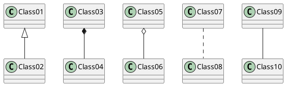

```markdown
@startuml
Class11 <|.. Class12
Class13 --> Class14
Class15 ..> Class16
Class17 ..|> Class18
Class19 <--* Class20
@enduml
```

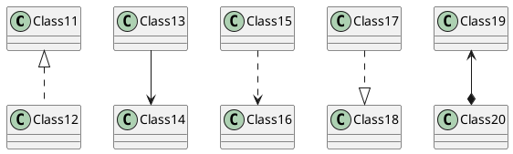

```markdown
@startuml
Class21 #-- Class22
Class23 x-- Class24
Class25 }-- Class26
Class27 +-- Class28
Class29 ^-- Class30
@enduml
```

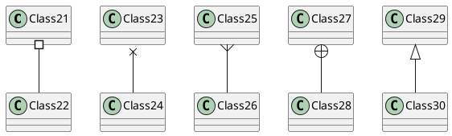

## 关系上的标识

在关系之间使用标签来说明时, 使用 `:`后接 标签文字。  
对元素的说明，你可以在每一边使用 `""` 来说明.  

```markdown
@startuml

Class01 "1" *-- "many" Class02 : contains

Class03 o-- Class04 : aggregation

Class05 --> "1" Class06

@enduml
```

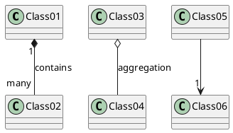

在标签的开始或结束位置添加`<` 或 `>`以表明是哪个对象作用到哪个对象上。

```markdown
@startuml
class Car

Driver - Car : drives >
Car *- Wheel : have 4 >
Car -- Person : < owns

@enduml
```

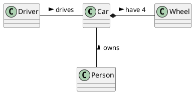

## 添加方法

为了声明字段(对象属性）或者方法，你可以使用 后接字段名或方法名。  
系统检查是否有括号来判断是方法还是字段。  

```markdown
@startuml
Object <|-- ArrayList

Object : equals()
ArrayList : Object[] elementData
ArrayList : size()

@enduml
```

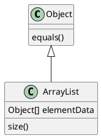

也可以使用`{}` 把字段或者方法括起来  
注意，这种语法对于类型/名字的顺序是非常灵活的。  

```markdown
@startuml
class Dummy {
  String data
  void methods()
}

class Flight {
   flightNumber : Integer
   departureTime : Date
}
@enduml
```

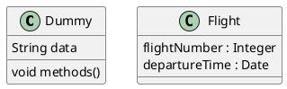

你可以（显式地）使用 `{field}` 和 `{method}` 修饰符来覆盖解析器的对于字段和方法的默认行为

```markdown
@startuml
class Dummy {
  {field} A field (despite parentheses)
  {method} Some method
}

@enduml
```

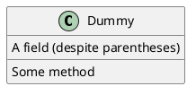

## 定义可访问性

一旦你定义了域或者方法，你可以定义 相应条目的可访问性质。

| **Character** | **Icon for field**                                           | **Icon for method**                                          | **Visibility**  |
| ------------- | ------------------------------------------------------------ | ------------------------------------------------------------ | --------------- |
| `-`           |          |         | private         |
| `#`           |        |       | protected       |
| `~`           |  |  | package private |
| `+`           |           |          | public          |

```markdown
@startuml

class Dummy {
 -field1
 #field2
 ~method1()
 +method2()
}

@enduml
```

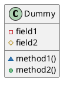

你可以采用以下命令停用这些特性 `skinparam classAttributeIconSize 0` ：

```markdown
@startuml
skinparam classAttributeIconSize 0
class Dummy {
 -field1
 #field2
 ~method1()
 +method2()
}

@enduml
```

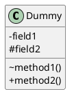

## 抽象与静态

通过修饰符`{static}`或者`{abstract}`，可以定义静态或者抽象的方法或者属性。  
这些修饰符可以写在行的开始或者结束。也可以使用`{classifier}`这个修饰符来代替`{static}`.  

```markdown
@startuml
class Dummy {
  {static} String id
  {abstract} void methods()
}
@enduml
```

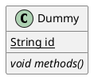

## 高级类体

PlantUML默认自动将方法和属性重新分组，你可以自己定义分隔符来重排方法和属性，下面的分隔符都是可用的：`--``..``==``__`.  
还可以在分隔符中添加标题：  

```markdown
@startuml
class Foo1 {
  You can use
  several lines
  ..
  as you want
  and group
  ==
  things together.
  __
  You can have as many groups
  as you want
  --
  End of class
}

class User {
  .. Simple Getter ..
  + getName()
  + getAddress()
  .. Some setter ..
  + setName()
  __ private data __
  int age
  -- encrypted --
  String password
}

@enduml
```

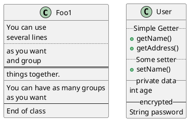

## 备注和模板

模板通过类关键字("`<<`"和"`>>`")来定义  
你可以使用`note left of` , `note right of` , `note top of` , `note bottom of`这些关键字来添加备注。  
你还可以在类的声明末尾使用`note left`, `note right`,`note top`, `note bottom`来添加备注。  
此外，单独用`note`这个关键字也是可以的，使用 `..` 符号可以作出一条连接它与其它对象的虚线。  

```markdown
@startuml
class Object << general >>
Object <|--- ArrayList

note top of Object : In java, every class\nextends this one.

note "This is a floating note" as N1
note "This note is connected\nto several objects." as N2
Object .. N2
N2 .. ArrayList

class Foo
note left: On last defined class

@enduml
```

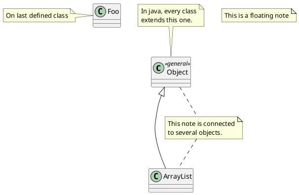

## 更多注释

可以在注释中使用部分html标签：  
* `<b>`
* `<u>`
* `<i>`
* `<s>`, `<del>`, `<strike>`
* `<font color="#AAAAAA">` or `<font color="colorName">`
* `<color:#AAAAAA>` or `<color:colorName>`
* `<size:nn>` to change font size
* `` or ``: the file must be accessible by the filesystem  

你也可以在注释中展示多行。  
你也可以在定义的class之后直接使用 note left, note right, note top, note bottom 来定义注释。  

```markdown
@startuml

class Foo
note left: On last defined class

note top of Object
  In java, <size:18>every</size> <u>class</u>
  <b>extends</b>
  <i>this</i> one.
end note

note as N1
  This note is <u>also</u>
  <b><color:royalBlue>on several</color>
  <s>words</s> lines
  And this is hosted by 
end note

@enduml
```

```plantuml
@startuml

class Foo
note left: On last defined class

note top of Object
  In java, <size:18>every</size> <u>class</u>
  <b>extends</b>
  <i>this</i> one.
end note

note as N1
  This note is <u>also</u>
  <b><color:royalBlue>on several</color>
  <s>words</s> lines
  And this is hosted by 
end note

@enduml
```

## 链接的注释

在定义链接之后，你可以用 `note on link` 给链接添加注释  
如果想要改变注释相对于标签的位置，你也可以用 `note left on link`， `note right on link`， `note bottom on link`。（对应位置分别在label的左边，右边，下边）  

```markdown
@startuml

class Dummy
Dummy --> Foo : A link
note on link #red: note that is red

Dummy --> Foo2 : Another link
note right on link #blue
this is my note on right link
and in blue
end note

@enduml
```

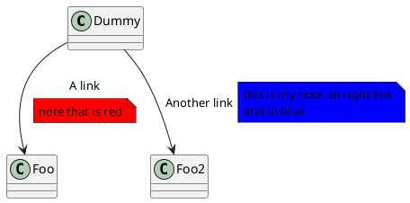

## 抽象类和接口

用关键字`abstract`或`abstract class`来定义抽象类。抽象类用斜体显示。 也可以使用`interface`, `annotation` 和 `enum`关键字。

```markdown
@startuml

abstract class AbstractList
abstract AbstractCollection
interface List
interface Collection

List <|-- AbstractList
Collection <|-- AbstractCollection

Collection <|- List
AbstractCollection <|- AbstractList
AbstractList <|-- ArrayList

class ArrayList {
  Object[] elementData
  size()
}

enum TimeUnit {
  DAYS
  HOURS
  MINUTES
}

annotation SuppressWarnings

@enduml
```

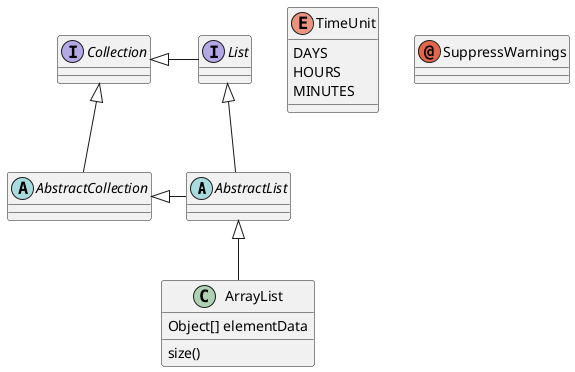

## 使用非字母字符

如果你想在类（或者枚举）的显示中使用[非字母符号](https://plantuml.com/zh/unicode)，你可以：  
- 在类的定义中使用 `as` 关键字
- 在类名旁边加上 `""`

```markdown
@startuml
class "This is my class" as class1
class class2 as "It works this way too"

class2 *-- "foo/dummy" : use
@enduml
```

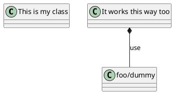

## 隐藏属性、函数等

通过使用命令“`hide/show`”，你可以用参数表示类的显示方式。  
基础命令是: `hide empty members`. 这个命令会隐藏空白的方法和属性。  
除 `empty members` 外，你可以用:  
- `empty fields` 或者 `empty attributes` 空属性,
- `empty methods` 空函数，
- `fields` 或 `attributes` 隐藏字段或属性，即使是被定义了
- `methods` 隐藏方法，即使是被定义了
- `members` 隐藏字段 和 方法，即使是被定义了
- `circle` 类名前带圈的，
- `stereotype` 原型。  

同样可以使用 `hide` 或 `show` 关键词，对以下内容进行设置：  
- `class` 所有类，
- `interface` 所有接口，
- `enum` 所有枚举，
- `<>` 实现 *foo1* 的类，
- 一个既定的类名。

你可以使用 `show/hide` 命令来定义相关规则和例外。  

```markdown
@startuml

class Dummy1 {
  +myMethods()
}

class Dummy2 {
  +hiddenMethod()
}

class Dummy3 <<Serializable>> {
String name
}

hide members
hide <<Serializable>> circle
show Dummy1 methods
show <<Serializable>> fields

@enduml
```

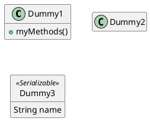

## 隐藏类

你也可以使用 `show/hide` 命令来隐藏类   
如果你定义了一个大的[!included](https://plantuml.com/zh/preprocessing) 文件，且想在文件包含之后隐藏部分类，该功能会很有帮助。  

```markdown
@startuml

class Foo1
class Foo2

Foo2 *-- Foo1

hide Foo2

@enduml
```


## 泛型（generics）

你可以用 `<` 和 `>` 来定义类的泛型。

```markdown
@startuml

class Foo<? extends Element> {
  int size()
}
Foo *- Element

@enduml
```

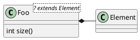

It is possible to disable this drawing using `skinparam genericDisplay old` command.

## 指定标记（Spot）

通常标记字符 (C, I, E or A) 用于标记 类(classes), 接口（interface）, 枚举（enum）和 抽象类（abstract classes）.  
但是当你想定义原型时，可以增加对应的单个字符及颜色，来定义自己的标记（spot），就像下面一样：  

```markdown
@startuml

class System << (S,#FF7700) Singleton >>
class Date << (D,orchid) >>
@enduml
```

```plantuml
@startuml

class System << (S,#FF7700) Singleton >>
class Date << (D,orchid) >>
@enduml
```

## 包

你可以通过关键词 `package` 声明包，同时可选的来声明对应的背景色（通过使用html色彩代码或名称）。  
注意：包可以被定义为嵌套。  

```markdown
@startuml

package "Classic Collections" #DDDDDD {
  Object <|-- ArrayList
}

package net.sourceforge.plantuml {
  Object <|-- Demo1
  Demo1 *- Demo2
}

@enduml
```

```plantuml
@startuml

package "Classic Collections" #DDDDDD {
  Object <|-- ArrayList
}

package net.sourceforge.plantuml {
  Object <|-- Demo1
  Demo1 *- Demo2
}

@enduml
```

## 包样式

包可以定义不同的样式。  
你可以通过以下的命令来设置默认样式 : `skinparam packageStyle`,或者对包使用对应的模板:  

```markdown
@startuml
scale 750 width
package foo1 <<Node>> {
  class Class1
}

package foo2 <<Rectangle>> {
  class Class2
}

package foo3 <<Folder>> {
  class Class3
}

package foo4 <<Frame>> {
  class Class4
}

package foo5 <<Cloud>> {
  class Class5
}

package foo6 <<Database>> {
  class Class6
}

@enduml
```

```plantuml
@startuml
scale 750 width
package foo1 <<Node>> {
  class Class1
}

package foo2 <<Rectangle>> {
  class Class2
}

package foo3 <<Folder>> {
  class Class3
}

package foo4 <<Frame>> {
  class Class4
}

package foo5 <<Cloud>> {
  class Class5
}

package foo6 <<Database>> {
  class Class6
}

@enduml
```

你也可以参考下面的示例来定义包之间的连线:

```markdown
@startuml

skinparam packageStyle rectangle

package foo1.foo2 {
}

package foo1.foo2.foo3 {
  class Object
}

foo1.foo2 +-- foo1.foo2.foo3

@enduml
```

```plantuml
@startuml

skinparam packageStyle rectangle

package foo1.foo2 {
}

package foo1.foo2.foo3 {
  class Object
}

foo1.foo2 +-- foo1.foo2.foo3

@enduml
```

## 命名空间（Namespaces）

在使用包（package）时（区别于命名空间），类名是类的唯一标识。 也就意味着，在不同的包（package）中的类，不能使用相同的类名。  
在那种情况下（译注：同名、不同全限定名类），你应该使用[命名空间](https://zh.wikipedia.org/wiki/命名空间)来取而代之。   
你可以从其他命名空间，使用全限定名来引用类， 默认命名空间（译注：无名的命名空间）下的类，以一个“."开头（的类名）来引用（译注：示例中的`BaseClass`).   
注意：你不用显示地创建命名空间：一个使用全限定名的类会自动被放置到对应的命名空间。

```markdown
@startuml

class BaseClass

namespace net.dummy #DDDDDD {
    .BaseClass <|-- Person
    Meeting o-- Person

    .BaseClass <|- Meeting
}

namespace net.foo {
  net.dummy.Person  <|- Person
  .BaseClass <|-- Person

  net.dummy.Meeting o-- Person
}

BaseClass <|-- net.unused.Person

@enduml
```

```plantuml
@startuml

class BaseClass

namespace net.dummy #DDDDDD {
    .BaseClass <|-- Person
    Meeting o-- Person

    .BaseClass <|- Meeting
}

namespace net.foo {
  net.dummy.Person  <|- Person
  .BaseClass <|-- Person

  net.dummy.Meeting o-- Person
}

BaseClass <|-- net.unused.Person

@enduml
```

## 自动创建命名空间

使用命令 `set namespaceSeparator ???` 你可以自定义命名空间分隔符（为 “.” 以外的字符）.

```markdown
@startuml

set namespaceSeparator ::
class X1::X2::foo {
  some info
}

@enduml
```

```plantuml
@startuml

set namespaceSeparator ::
class X1::X2::foo {
  some info
}

@enduml
```

禁止自动创建包则可以使用 `set namespaceSeparator none`.

```markdown
@startuml

set namespaceSeparator none
class X1.X2.foo {
  some info
}

@enduml
```

```plantuml
@startuml

set namespaceSeparator none
class X1.X2.foo {
  some info
}

@enduml
```

## 棒棒糖 接口

需要定义棒棒糖样式的接口时可以遵循以下语法:  
- `bar ()- foo`
- `bar ()-- foo`
- `foo -() bar`

```markdown
@startuml
class foo
bar ()- foo
@enduml
```

```plantuml
@startuml
class foo
bar ()- foo
@enduml
```

## 改变箭头方向

类之间默认采用两个破折号 `--` 显示出垂直 方向的线. 要得到水平方向的可以像这样使用单破折号 (或者点):

```markdown
@startuml
Room o- Student
Room *-- Chair
@enduml
```

```plantuml
@startuml
Room o- Student
Room *-- Chair
@enduml
```

你也可以通过改变倒置链接来改变方向

```markdown
@startuml
Student -o Room
Chair --* Room
@enduml
```

```plantuml
@startuml
Student -o Room
Chair --* Room
@enduml
```

也可通过在箭头内部使用关键字， 例如`left`, `right`, `up` 或者 `down`，来改变方向

```markdown
@startuml
foo -left-> dummyLeft
foo -right-> dummyRight
foo -up-> dummyUp
foo -down-> dummyDown
@enduml
```

```plantuml
@startuml
foo -left-> dummyLeft
foo -right-> dummyRight
foo -up-> dummyUp
foo -down-> dummyDown
@enduml
```

You can shorten the arrow by using only the first character of the direction (for example, `-d-` instead of `-down-`) or the two first characters (`-do-`).  
Please note that you should not abuse this functionality : *Graphviz* gives usually good results without tweaking.  

## “关系”类

你可以在定义了两个类之间的关系后定义一个 *关系类 association class* 例如:

```markdown
@startuml
class Student {
  Name
}
Student "0..*" - "1..*" Course
(Student, Course) .. Enrollment

class Enrollment {
  drop()
  cancel()
}
@enduml
```

```plantuml
@startuml
class Student {
  Name
}
Student "0..*" - "1..*" Course
(Student, Course) .. Enrollment

class Enrollment {
  drop()
  cancel()
}
@enduml
```

也可以用另一种方式:

```markdown
@startuml
class Student {
  Name
}
Student "0..*" -- "1..*" Course
(Student, Course) . Enrollment

class Enrollment {
  drop()
  cancel()
}
@enduml
```

```plantuml
@startuml
class Student {
  Name
}
Student "0..*" -- "1..*" Course
(Student, Course) . Enrollment

class Enrollment {
  drop()
  cancel()
}
@enduml
```

## 皮肤参数

用[skinparam](https://plantuml.com/zh/skinparam)改变字体和颜色。  
可以在如下场景中使用：  
- 在图示的定义中，
- [在引入的文件中](https://plantuml.com/zh/preprocessing)，
- 在[命令行](https://plantuml.com/zh/command-line)或者[ANT任务](https://plantuml.com/zh/ant-task)提供的配置文件中。

```markdown
@startuml

skinparam class {
BackgroundColor PaleGreen
ArrowColor SeaGreen
BorderColor SpringGreen
}
skinparam stereotypeCBackgroundColor YellowGreen

Class01 "1" *-- "many" Class02 : contains

Class03 o-- Class04 : aggregation

@enduml
```

```plantuml
@startuml

skinparam class {
BackgroundColor PaleGreen
ArrowColor SeaGreen
BorderColor SpringGreen
}
skinparam stereotypeCBackgroundColor YellowGreen

Class01 "1" *-- "many" Class02 : contains

Class03 o-- Class04 : aggregation

@enduml
```

## Skinned Stereotypes

You can define specific color and fonts for stereotyped classes.

```markdown
@startuml

skinparam class {
BackgroundColor PaleGreen
ArrowColor SeaGreen
BorderColor SpringGreen
BackgroundColor<<Foo>> Wheat
BorderColor<<Foo>> Tomato
}
skinparam stereotypeCBackgroundColor YellowGreen
skinparam stereotypeCBackgroundColor<< Foo >> DimGray

Class01 <<Foo>>
Class03 <<Foo>>
Class01 "1" *-- "many" Class02 : contains

Class03 o-- Class04 : aggregation

@enduml
```

```plantuml
@startuml

skinparam class {
BackgroundColor PaleGreen
ArrowColor SeaGreen
BorderColor SpringGreen
BackgroundColor<<Foo>> Wheat
BorderColor<<Foo>> Tomato
}
skinparam stereotypeCBackgroundColor YellowGreen
skinparam stereotypeCBackgroundColor<< Foo >> DimGray

Class01 <<Foo>>
Class03 <<Foo>>
Class01 "1" *-- "many" Class02 : contains

Class03 o-- Class04 : aggregation

@enduml
```

## Color gradient

It's possible to declare individual color for classes or note using the # notation.  
You can use either [standard color name](https://plantuml.com/zh/color) or RGB code.  
You can also use color gradient in background, with the following syntax: two colors names separated either by:  

- `|`,
- `/`,
- `\`,
- or `-`

depending the direction of the gradient.  
For example, you could have:    

```markdown
@startuml

skinparam backgroundcolor AntiqueWhite/Gold
skinparam classBackgroundColor Wheat|CornflowerBlue

class Foo #red-green
note left of Foo #blue\9932CC
  this is my
  note on this class
end note

package example #GreenYellow/LightGoldenRodYellow {
  class Dummy
}

@enduml
```

```plantuml
@startuml

skinparam backgroundcolor AntiqueWhite/Gold
skinparam classBackgroundColor Wheat|CornflowerBlue

class Foo #red-green
note left of Foo #blue\9932CC
  this is my
  note on this class
end note

package example #GreenYellow/LightGoldenRodYellow {
  class Dummy
}

@enduml
```

## 辅助布局

有时候，默认布局并不完美...  
你可以使用 `together` 关键词将某些类进行分组： 布局引擎会尝试将它们捆绑在一起（如同在一个包(package)内)  
你也可以使用建立 `隐藏` 链接的方式来强制布局  

```markdown
@startuml

class Bar1
class Bar2
together {
  class Together1
  class Together2
  class Together3
}
Together1 - Together2
Together2 - Together3
Together2 -[hidden]--> Bar1
Bar1 -[hidden]> Bar2


@enduml
```

```plantuml
@startuml

class Bar1
class Bar2
together {
  class Together1
  class Together2
  class Together3
}
Together1 - Together2
Together2 - Together3
Together2 -[hidden]--> Bar1
Bar1 -[hidden]> Bar2


@enduml
```

## 拆分大文件

有些情况下，会有一些很大的图片文件。  
可以用 `page (hpages)x(vpages)` 这个命令把生成的图片文件拆分成若干个文件。  
`hpages` 用来表示水平方向页面数， and `vpages` 用来表示垂直方面页面数。  
你也可以使用特定的皮肤设定来给分页添加边框（见例子）  

```markdown
@startuml
' Split into 4 pages
page 2x2
skinparam pageMargin 10
skinparam pageExternalColor gray
skinparam pageBorderColor black

class BaseClass

namespace net.dummy #DDDDDD {
    .BaseClass <|-- Person
    Meeting o-- Person

    .BaseClass <|- Meeting

}

namespace net.foo {
  net.dummy.Person  <|- Person
  .BaseClass <|-- Person

  net.dummy.Meeting o-- Person
}

BaseClass <|-- net.unused.Person
@enduml
```

```plantuml
@startuml
' Split into 4 pages
page 2x2
skinparam pageMargin 10
skinparam pageExternalColor gray
skinparam pageBorderColor black

class BaseClass

namespace net.dummy #DDDDDD {
    .BaseClass <|-- Person
    Meeting o-- Person

    .BaseClass <|- Meeting

}

namespace net.foo {
  net.dummy.Person  <|- Person
  .BaseClass <|-- Person

  net.dummy.Meeting o-- Person
}

BaseClass <|-- net.unused.Person
@enduml
```

## Extends and implements

It is also possible to use `extends` and `implements` keywords.

```markdown
@startuml
class ArrayList implements List
class ArrayList extends AbstractList
@enduml
```

```plantuml
@startuml
class ArrayList implements List
class ArrayList extends AbstractList
@enduml
```

