# 第二章 第4节：活动图

[当前活动图(activity diagram)](https://plantuml.com/zh/activity-diagram-legacy)的语法有诸多限制和缺点，比如代码难以维护。  
所以从V7947开始提出一种全新的、更好的语法格式和软件实现供用户使用(beta版)。  
就像序列图一样，新的软件实现的另一个优点是它不再依赖于Graphviz。   
新的语法将会替换旧的语法。然而考虑到兼容性，旧的语法仍被能够使用以确保*向前兼容*。  
但是我们鼓励用户使用新的语法格式。  

## 简单活动图

活动标签(activity label)以冒号开始，以分号结束。  
文本格式支持[creole wiki](https://plantuml.com/zh/creole)语法。  
活动默认安装它们定义的顺序就行连接。  

```markdown
@startuml
:Hello world;
:This is on defined on
several **lines**;
@enduml
```

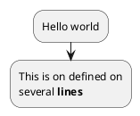

## 开始/结束

你可以使用关键字`start`和`stop`表示图示的开始和结束。

```markdown
@startuml
start
:Hello world;
:This is on defined on
several **lines**;
stop
@enduml
```

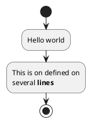

也可以使用 `end` 关键字。

```markdown
@startuml
start
:Hello world;
:This is on defined on
several **lines**;
end
@enduml
```

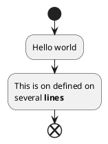

## 条件语句

在图示中可以使用关键字`if`，`then`和`else`设置分支测试。标注文字则放在括号中。

```markdown
@startuml

start

if (Graphviz installed?) then (yes)
  :process all\ndiagrams;
else (no)
  :process only
  __sequence__ and __activity__ diagrams;
endif

stop

@enduml
```

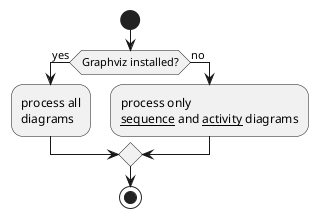

也可以使用关键字`elseif`设置多个分支测试。

```markdown
@startuml
start
if (condition A) then (yes)
  :Text 1;
elseif (condition B) then (yes)
  :Text 2;
  stop
elseif (condition C) then (yes)
  :Text 3;
elseif (condition D) then (yes)
  :Text 4;
else (nothing)
  :Text else;
endif
stop
@enduml
```

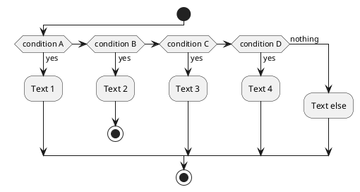

## 重复循环

你可以使用关键字`repeat`和`repeatwhile`进行重复循环。

```markdown
@startuml

start

repeat
  :read data;
  :generate diagrams;
repeat while (more data?)

stop

@enduml
```

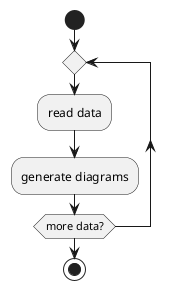

It is also possible to use a full action as `repeat` target and insert an action in the return path using the `backward` keyword.

```markdown
@startuml

start

repeat :foo as starting label;
  :read data;
  :generate diagrams;
backward:This is backward;
repeat while (more data?)

stop

@enduml
```

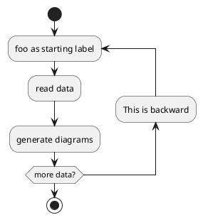

## while循环

可以使用关键字`while`和`end while`进行while循环。

```markdown
@startuml

start

while (data available?)
  :read data;
  :generate diagrams;
endwhile

stop

@enduml
```

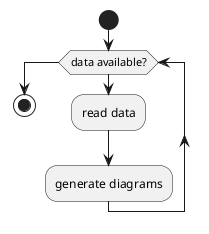

还可以在关键字`endwhile`后添加标注，还有一种方式是使用关键字`is`。

```markdown
@startuml
while (check filesize ?) is (not empty)
  :read file;
endwhile (empty)
:close file;
@enduml
```

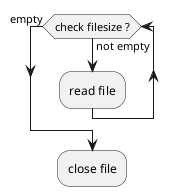

## 并行处理

你可以使用关键字`fork`，`fork again`和`end fork`表示并行处理。

```markdown
@startuml

start

if (multiprocessor?) then (yes)
  fork
    :Treatment 1;
  fork again
    :Treatment 2;
  end fork
else (monoproc)
  :Treatment 1;
  :Treatment 2;
endif

@enduml
```

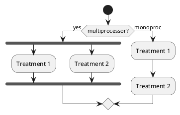

## 注释

文本格式支持[creole wiki](https://plantuml.com/zh/creole)语法。  
A note can be floating, using `floating` keyword.  

```markdown
@startuml

start
:foo1;
floating note left: This is a note
:foo2;
note right
  This note is on several
  //lines// and can
  contain <b>HTML</b>
  ====
  * Calling the method ""foo()"" is prohibited
end note
stop

@enduml
```

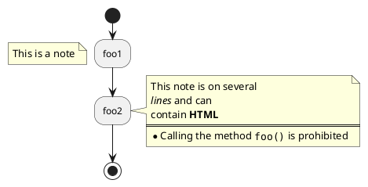

## 颜色

你可以为活动(activity)指定一种[颜色](https://plantuml.com/zh/color)。

```markdown
@startuml

start
:starting progress;
#HotPink:reading configuration files
These files should edited at this point!;
#AAAAAA:ending of the process;

@enduml
```

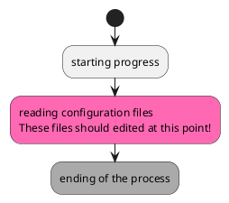

## 箭头

使用`->`标记，你可以给箭头添加文字或者修改箭头[颜色](https://plantuml.com/zh/color)。  
同时，你也可以选择点状 (dotted)，条状(dashed)，加粗或者是隐式箭头  

```markdown
@startuml
:foo1;
-> You can put text on arrows;
if (test) then
  -[#blue]->
  :foo2;
  -[#green,dashed]-> The text can
  also be on several lines
  and **very** long...;
  :foo3;
else
  -[#black,dotted]->
  :foo4;
endif
-[#gray,bold]->
:foo5;
@enduml
```

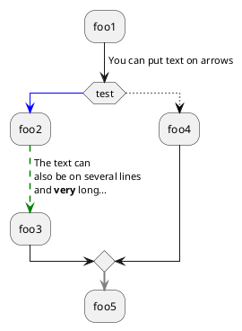

## 连接器(Connector)

你可以使用括号定义连接器。

```markdown
@startuml
start
:Some activity;
(A)
detach
(A)
:Other activity;
@enduml
```

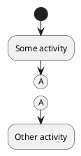

## 组合(grouping)

通过定义分区(partition)，你可以把多个活动组合(group)在一起。

```markdown
@startuml
start
partition Initialization {
    :read config file;
    :init internal variable;
}
partition Running {
    :wait for user interaction;
    :print information;
}

stop
@enduml
```

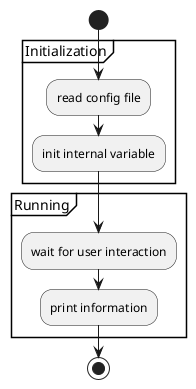

## 泳道(Swimlanes)

你可以使用管道符`|`来定义泳道。  
还可以改变泳道的[颜色](https://plantuml.com/zh/color)。  

```markdown
@startuml
|Swimlane1|
start
:foo1;
|#AntiqueWhite|Swimlane2|
:foo2;
:foo3;
|Swimlane1|
:foo4;
|Swimlane2|
:foo5;
stop
@enduml
```

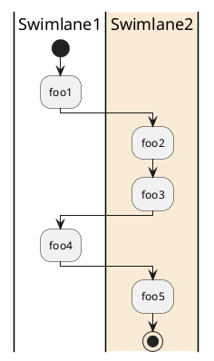

## 分离(detach)

可以使用关键字`detach`移除箭头。

```markdown
@startuml
 :start;
 fork
   :foo1;
   :foo2;
 fork again
   :foo3;
   detach
 endfork
 if (foo4) then
   :foo5;
   detach
 endif
 :foo6;
 detach
 :foo7;
 stop
@enduml
```

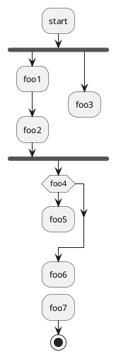

## 特殊领域语言(SDL)

通过修改活动标签最后的分号分隔符(`;`)，可以为活动设置不同的形状。  
- `|`
- `<`
- `>`
- `/`
- `]`
- `}`

```markdown
@startuml
:Ready;
:next(o)|
:Receiving;
split
 :nak(i)<
 :ack(o)>
split again
 :ack(i)<
 :next(o)
 on several line|
 :i := i + 1]
 :ack(o)>
split again
 :err(i)<
 :nak(o)>
split again
 :foo/
split again
 :i > 5}
stop
end split
:finish;
@enduml
```

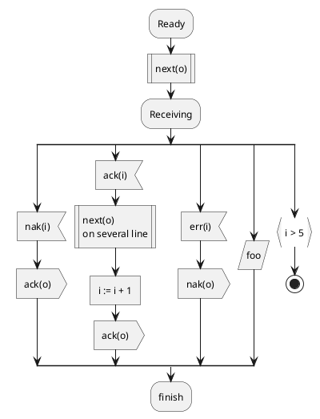

## 一个完整的例子

```markdown
@startuml

start
:ClickServlet.handleRequest();
:new page;
if (Page.onSecurityCheck) then (true)
  :Page.onInit();
  if (isForward?) then (no)
    :Process controls;
    if (continue processing?) then (no)
      stop
    endif

    if (isPost?) then (yes)
      :Page.onPost();
    else (no)
      :Page.onGet();
    endif
    :Page.onRender();
  endif
else (false)
endif

if (do redirect?) then (yes)
  :redirect process;
else
  if (do forward?) then (yes)
    :Forward request;
  else (no)
    :Render page template;
  endif
endif

stop

@enduml
```

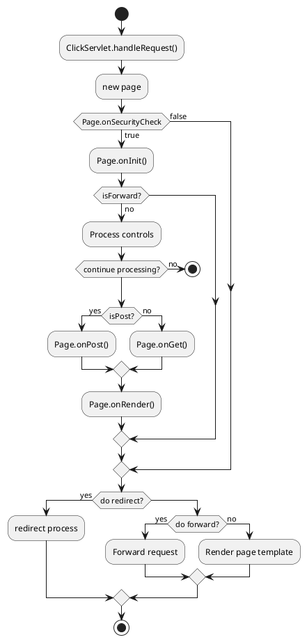

