# 第二章 第5节：组件图

我们来看几个例子 :

## 组件

组件必须用中括号括起来。

还可以使用关键字`component`定义一个组件。 并且可以用关键字`as`给组件定义一个别名。 这个别名可以在稍后定义关系的时候使用。

```markdown
@startuml

[First component]
[Another component] as Comp2
component Comp3
component [Last\ncomponent] as Comp4

@enduml
```

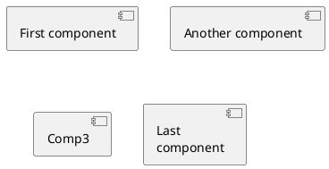

## 接口

接口可以使用`()`来定义(因为这个看起来像个圆)。  

还可以使用关键字`interface`关键字来定义接口。 并且还可以使用关键字`as`定义一个别名。 这个别名可以在稍后定义关系的时候使用。  

我们稍后可以看到，接口的定义是可选的。

```markdown
@startuml

() "First Interface"
() "Another interface" as Interf2
interface Interf3
interface "Last\ninterface" as Interf4

@enduml
```

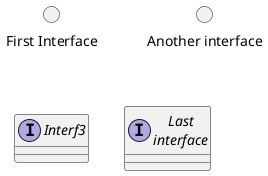

## 基础的示例

元素之间可以使用虚线(`..`)、直线(`--`)、箭头(`-->`)进行连接。

```markdown
@startuml

DataAccess - [First Component]
[First Component] ..> HTTP : use

@enduml
```

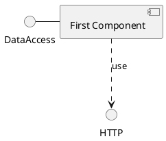

## 使用注释

你可以使用 `note left of` , `note right of` , `note top of` , `note bottom of` 等关键字定义相对于对象位置的注释。   

也可以使用关键字`note`单独定义注释，然后使用虚线(`..`)将其连接到其他对象。  

```markdown
@startuml

interface "Data Access" as DA

DA - [First Component]
[First Component] ..> HTTP : use

note left of HTTP : Web Service only

note right of [First Component]
  A note can also
  be on several lines
end note

@enduml
```

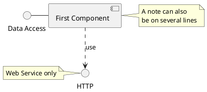

## 组合组件

你可以使用多个关键字将组件和接口组合在一起。  
- `package`
- `node`
- `folder`
- `frame`
- `cloud`
- `database`

```markdown
@startuml

package "Some Group" {
  HTTP - [First Component]
  [Another Component]
}

node "Other Groups" {
  FTP - [Second Component]
  [First Component] --> FTP
}

cloud {
  [Example 1]
}


database "MySql" {
  folder "This is my folder" {
    [Folder 3]
  }
  frame "Foo" {
    [Frame 4]
  }
}


[Another Component] --> [Example 1]
[Example 1] --> [Folder 3]
[Folder 3] --> [Frame 4]

@enduml
```

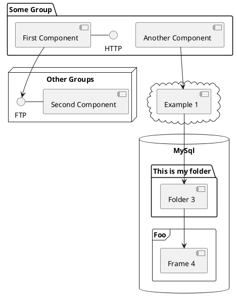

## 改变箭头方向

默认情况下，对象之间用`--`连接，并且连接是竖直的。不过可以使用一个横线或者点设置水平方向的连接，就行这样：

```markdown
@startuml
[Component] --> Interface1
[Component] -> Interface2
@enduml
```

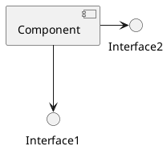

也可以使用反向连接：

```markdown
@startuml
Interface1 <-- [Component]
Interface2 <- [Component]
@enduml
```

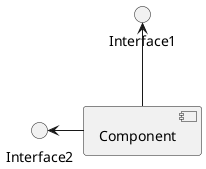

还可以使用关键字`left`, `right`, `up` or `down`改变箭头方向。

```markdown
@startuml
[Component] -left-> left
[Component] -right-> right
[Component] -up-> up
[Component] -down-> down
@enduml
```

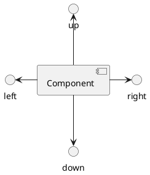

允许使用方向单词的首字母或者前两个字母表示方向(例如`-d-`, `-do-`, `-down-`都是等价的)。  

请不要乱用这些功能：*Graphviz*(PlantUML的后端引擎)不喜欢这个样子。

## 使用UML2标记符

命令`skinparam componentStyle uml2` 可以切换到UML2标记符。

```markdown
@startuml
skinparam componentStyle uml2

interface "Data Access" as DA

DA - [First Component]
[First Component] ..> HTTP : use

@enduml
```

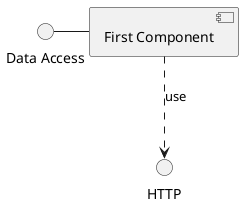

## 长描述

可以用方括号"[ ]"在连线上添加描述。

```markdown
@startuml
component comp1 [
This component
has a long comment
on several lines
]
@enduml
```

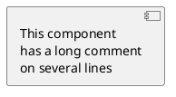

## 不同的颜色表示

你可以在声明一个组件时加上颜色的声明。

```markdown
@startuml
component  [Web Server] #Yellow
@enduml
```

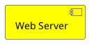

## 在定型组件中使用精灵图

你可以在定型组件中使用精灵图（sprite）。

```markdown
@startuml
sprite $businessProcess [16x16/16] {
FFFFFFFFFFFFFFFF
FFFFFFFFFFFFFFFF
FFFFFFFFFFFFFFFF
FFFFFFFFFFFFFFFF
FFFFFFFFFF0FFFFF
FFFFFFFFFF00FFFF
FF00000000000FFF
FF000000000000FF
FF00000000000FFF
FFFFFFFFFF00FFFF
FFFFFFFFFF0FFFFF
FFFFFFFFFFFFFFFF
FFFFFFFFFFFFFFFF
FFFFFFFFFFFFFFFF
FFFFFFFFFFFFFFFF
FFFFFFFFFFFFFFFF
}


rectangle " End to End\nbusiness process" <<$businessProcess>> {
 rectangle "inner process 1" <<$businessProcess>> as src
 rectangle "inner process 2" <<$businessProcess>> as tgt
 src -> tgt
}
@enduml
```

```plantuml
@startuml
sprite $businessProcess [16x16/16] {
FFFFFFFFFFFFFFFF
FFFFFFFFFFFFFFFF
FFFFFFFFFFFFFFFF
FFFFFFFFFFFFFFFF
FFFFFFFFFF0FFFFF
FFFFFFFFFF00FFFF
FF00000000000FFF
FF000000000000FF
FF00000000000FFF
FFFFFFFFFF00FFFF
FFFFFFFFFF0FFFFF
FFFFFFFFFFFFFFFF
FFFFFFFFFFFFFFFF
FFFFFFFFFFFFFFFF
FFFFFFFFFFFFFFFF
FFFFFFFFFFFFFFFF
}


rectangle " End to End\nbusiness process" <<$businessProcess>> {
 rectangle "inner process 1" <<$businessProcess>> as src
 rectangle "inner process 2" <<$businessProcess>> as tgt
 src -> tgt
}
@enduml
```

## 显示参数

用[skinparam](https://plantuml.com/zh/skinparam)改变字体和颜色。  
可以在如下场景中使用：  
- 在图示的定义中，
- [在引入的文件中](https://plantuml.com/zh/preprocessing)，
- 在[命令行](https://plantuml.com/zh/command-line)或者[ANT任务](https://plantuml.com/zh/ant-task)提供的配置文件中。  

可以为构造类型和接口定义特殊的颜色和字体。

```markdown
@startuml

skinparam interface {
  backgroundColor RosyBrown
  borderColor orange
}

skinparam component {
  FontSize 13
  BackgroundColor<<Apache>> Red
  BorderColor<<Apache>> #FF6655
  FontName Courier
  BorderColor black
  BackgroundColor gold
  ArrowFontName Impact
  ArrowColor #FF6655
  ArrowFontColor #777777
}

() "Data Access" as DA

DA - [First Component]
[First Component] ..> () HTTP : use
HTTP - [Web Server] << Apache >>

@enduml
```

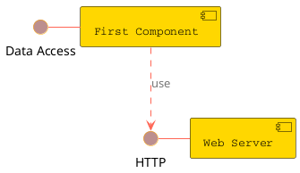

```markdown
@startuml
[AA] <<static lib>>
[BB] <<shared lib>>
[CC] <<static lib>>

node node1
node node2 <<shared node>>
database Production

skinparam component {
    backgroundColor<<static lib>> DarkKhaki
    backgroundColor<<shared lib>> Green
}

skinparam node {
borderColor Green
backgroundColor Yellow
backgroundColor<<shared node>> Magenta
}
skinparam databaseBackgroundColor Aqua

@enduml
```

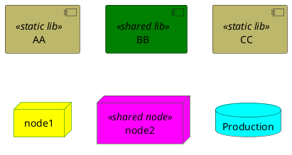

