# 第二章 第6节：状态图

## 简单状态

使用(`[*]`)开始和结束状态图。  

使用`-->`添加箭头。  

```markdown
@startuml

[*] --> State1
State1 --> [*]
State1 : this is a string
State1 : this is another string

State1 -> State2
State2 --> [*]

@enduml
```

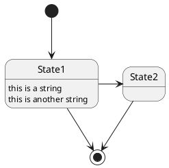

## Change state rendering

You can use `hide empty description` to render state as simple box.

```markdown
@startuml
hide empty description
[*] --> State1
State1 --> [*]
State1 : this is a string
State1 : this is another string

State1 -> State2
State2 --> [*]
@enduml
```

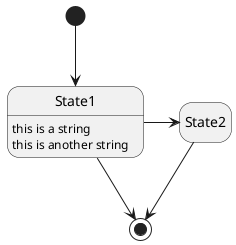

## 合成状态

一个状态也可能是合成的，必须使用关键字`state`和花括号来定义合成状态。

```markdown
@startuml
scale 350 width
[*] --> NotShooting

state NotShooting {
  [*] --> Idle
  Idle --> Configuring : EvConfig
  Configuring --> Idle : EvConfig
}

state Configuring {
  [*] --> NewValueSelection
  NewValueSelection --> NewValuePreview : EvNewValue
  NewValuePreview --> NewValueSelection : EvNewValueRejected
  NewValuePreview --> NewValueSelection : EvNewValueSaved

  state NewValuePreview {
     State1 -> State2
  }

}
@enduml
```

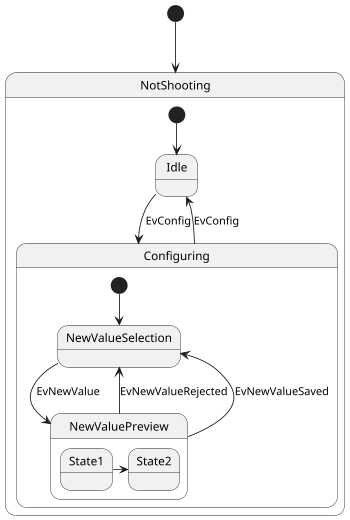

## 长名字

也可以使用关键字`state`定义长名字状态。

```markdown
@startuml
scale 600 width

[*] -> State1
State1 --> State2 : Succeeded
State1 --> [*] : Aborted
State2 --> State3 : Succeeded
State2 --> [*] : Aborted
state State3 {
  state "Accumulate Enough Data\nLong State Name" as long1
  long1 : Just a test
  [*] --> long1
  long1 --> long1 : New Data
  long1 --> ProcessData : Enough Data
}
State3 --> State3 : Failed
State3 --> [*] : Succeeded / Save Result
State3 --> [*] : Aborted

@enduml
```

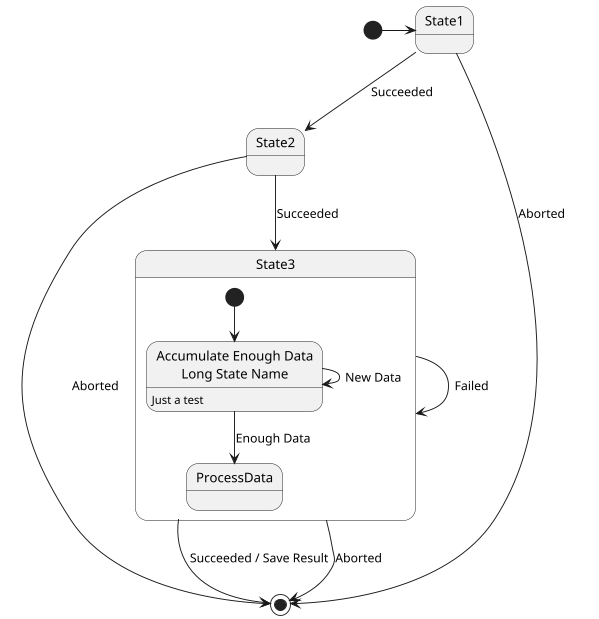

## History

You can use [H] for the history and [H*] for the deep history of a substate

```markdown
@startuml
[*] -> State1
State1 --> State2 : Succeeded
State1 --> [*] : Aborted
State2 --> State3 : Succeeded
State2 --> [*] : Aborted
state State3 {
  state "Accumulate Enough Data" as long1
  long1 : Just a test
  [*] --> long1
  long1 --> long1 : New Data
  long1 --> ProcessData : Enough Data
  State2 --> [H]: Resume
}
State3 --> State2 : Pause
State2 --> State3[H*]: DeepResume
State3 --> State3 : Failed
State3 --> [*] : Succeeded / Save Result
State3 --> [*] : Aborted
@enduml
```

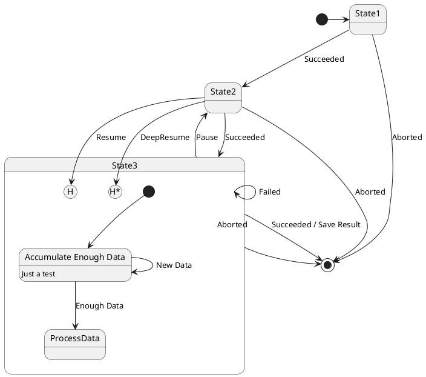

## Fork

You can also fork and join using the `<>` and `<>` stereotypes.

```markdown
@startuml

state fork_state <<fork>>
[*] --> fork_state
fork_state --> State2
fork_state --> State3

state join_state <<join>>
State2 --> join_state
State3 --> join_state
join_state --> State4
State4 --> [*]

@enduml
```

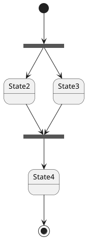

## 并发状态

用`--` or `||`作为分隔符来合成并发状态。

```markdown
@startuml
[*] --> Active

state Active {
  [*] -> NumLockOff
  NumLockOff --> NumLockOn : EvNumLockPressed
  NumLockOn --> NumLockOff : EvNumLockPressed
  --
  [*] -> CapsLockOff
  CapsLockOff --> CapsLockOn : EvCapsLockPressed
  CapsLockOn --> CapsLockOff : EvCapsLockPressed
  --
  [*] -> ScrollLockOff
  ScrollLockOff --> ScrollLockOn : EvCapsLockPressed
  ScrollLockOn --> ScrollLockOff : EvCapsLockPressed
}

@enduml
```

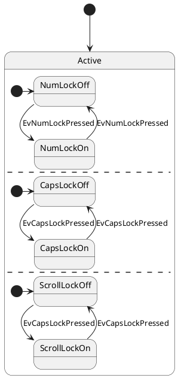

## Conditional

The stereotype `<>` can be used to use conditional state.

```markdown
@startuml
state "Req(Id)" as ReqId <<sdlreceive>>
state "Minor(Id)" as MinorId
state "Major(Id)" as MajorId
 
state c <<choice>>
 
Idle --> ReqId
ReqId --> c
c --> MinorId : [Id <= 10]
c --> MajorId : [Id > 10]
@enduml
```

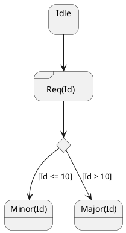

## 箭头方向

使用`->`定义水平箭头，也可以使用下列格式强制设置箭头方向：  
- `-down->` (default arrow)
- `-right->` or `->`
- `-left->`
- `-up->`

```markdown
@startuml

[*] -up-> First
First -right-> Second
Second --> Third
Third -left-> Last

@enduml
```

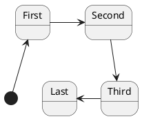

可以用首字母缩写或者开始的两个字母定义方向(如, `-d-`，`-down-`和`-do-`是完全等价的)。  

请不要滥用这些功能，*Graphviz*不喜欢这样。

## 注释

可以用 `note left of`, `note right of`, `note top of`, `note bottom of` 关键字来定义注释。  

还可以定义多行注释。

```markdown
@startuml

[*] --> Active
Active --> Inactive

note left of Active : this is a short\nnote

note right of Inactive
  A note can also
  be defined on
  several lines
end note

@enduml
```

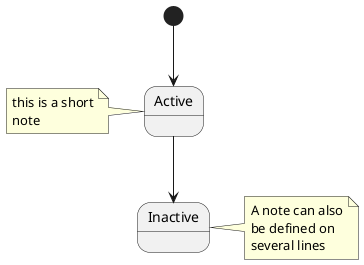

以及浮动注释。

```markdown
@startuml

state foo
note "This is a floating note" as N1

@enduml
```

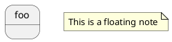

## 更多注释

可以在合成状态中放置注释。

```markdown
@startuml

[*] --> NotShooting

state "Not Shooting State" as NotShooting {
  state "Idle mode" as Idle
  state "Configuring mode" as Configuring
  [*] --> Idle
  Idle --> Configuring : EvConfig
  Configuring --> Idle : EvConfig
}

note right of NotShooting : This is a note on a composite state

@enduml
```

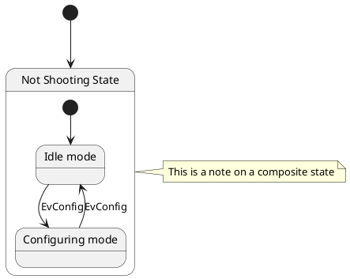

## 显示参数

用[skinparam](https://plantuml.com/zh/skinparam)改变字体和颜色。  
可以在如下场景中使用：  
- 在图示的定义中，
- [在引入的文件中](https://plantuml.com/zh/preprocessing)，
- 在[命令行](https://plantuml.com/zh/command-line)或者[ANT任务](https://plantuml.com/zh/ant-task)提供的配置文件中。  

还可以为状态的构造类型指定特殊的字体和颜色。

```markdown
@startuml
skinparam backgroundColor LightYellow
skinparam state {
  StartColor MediumBlue
  EndColor Red
  BackgroundColor Peru
  BackgroundColor<<Warning>> Olive
  BorderColor Gray
  FontName Impact
}

[*] --> NotShooting

state "Not Shooting State" as NotShooting {
  state "Idle mode" as Idle <<Warning>>
  state "Configuring mode" as Configuring
  [*] --> Idle
  Idle --> Configuring : EvConfig
  Configuring --> Idle : EvConfig
}

NotShooting --> [*]
@enduml
```

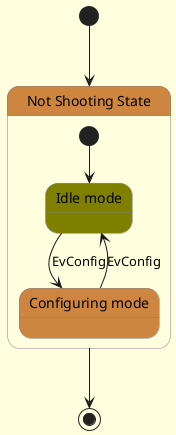

