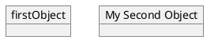
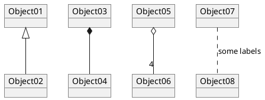
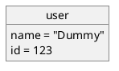

# 第二章 第7节：对象图

## 对象的定义

使用关键字`object`定义实例。

```markdown
@startuml
object firstObject
object "My Second Object" as o2
@enduml
```



## 对象之间的关系

对象之间的关系通过下面的符号定义 :

| Type                | Symbol                           | Drawing                                                    |
| ------------------- | -------------------------------- | ---------------------------------------------------------- |
| Extension（扩展）   | $$\color{fuchsia}{\verb+<|--+}$$ |  |
| Composition（组合） | $$\color{fuchsia}{\verb+*--+}$$  |      |
| Aggregation（聚合） | $$\color{fuchsia}{\verb+o--+}$$  |      |

使用`..` 来代替 `--` 可以得到点 线. 

知道了这些规则，就可以画下面的图：  

可以用冒号给关系添加标签，标签内容紧跟在冒号之后。  

用双引号在关系的两边添加基数。  

```markdown
@startuml
object Object01
object Object02
object Object03
object Object04
object Object05
object Object06
object Object07
object Object08

Object01 <|-- Object02
Object03 *-- Object04
Object05 o-- "4" Object06
Object07 .. Object08 : some labels
@enduml
```



## 添加属性

用冒号加属性名的形式声明属性。

```markdown
@startuml

object user

user : name = "Dummy"
user : id = 123

@enduml
```



也可以用大括号批量声明属性。

```markdown
@startuml

object user {
  name = "Dummy"
  id = 123
}

@enduml
```


## 类图中的通用特性

- [可见性](https://plantuml.com/zh/class-diagram#Visibility)
- [定义注释](https://plantuml.com/zh/class-diagram#Notes)
- [使用包](https://plantuml.com/zh/class-diagram#Using)
- [美化输出内容](https://plantuml.com/zh/class-diagram#Skinparam)