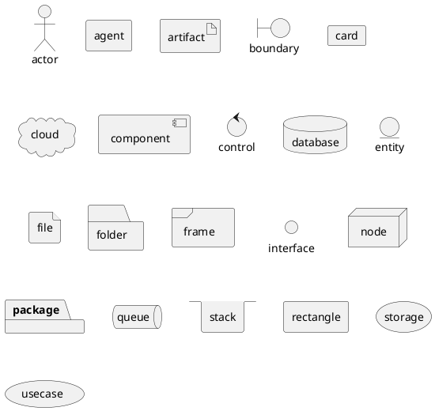
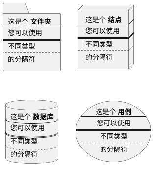
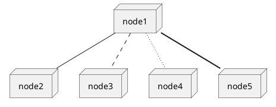
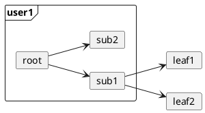
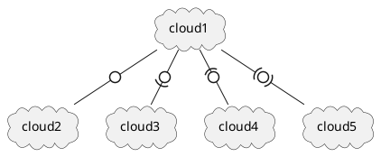
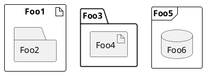
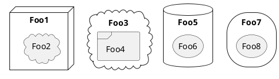
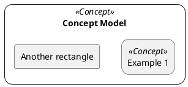

# 第二章 第8节：部署图

## 声明元素

```markdown
@startuml
actor actor
agent agent
artifact artifact
boundary boundary
card card
cloud cloud
component component
control control
database database
entity entity
file file
folder folder
frame frame
interface  interface
node node
package package
queue queue
stack stack
rectangle rectangle
storage storage
usecase usecase
@enduml
```



可选的，您可以使用方括号 `[]` 放置长描述文本。

```markdown
@startuml
folder folder [
这是个 <b>文件夹
----
您可以使用
====
不同类型
....
的分隔符
]

node node [
这是个 <b>结点
----
您可以使用
====
不同类型
....
的分隔符
]

database database [
这是个 <b>数据库
----
您可以使用
====
不同类型
....
的分隔符
]

usecase usecase [
这是个 <b>用例
----
您可以使用
====
不同类型
....
的分隔符
]

@enduml
```



## 链接

您可以在元素之间创建简单链接:

```markdown
@startuml

node node1
node node2
node node3
node node4
node node5
node1 -- node2
node1 .. node3
node1 ~~ node4
node1 == node5

@enduml
```



您可以在元素之间创建简单链接:

```markdown
@startuml

node node1
node node2
node node3
node node4
node node5
node1 -- node2
node1 .. node3
node1 ~~ node4
node1 == node5

@enduml
```


横向的链接:

```markdown
@startuml
left to right direction
frame user1{
card root
card sub1
card sub2
}

card leaf1
card leaf2

root-->sub1
root-->sub2
sub1-->leaf1
sub1-->leaf2
@enduml
```



您还可以使用以下类型:

```markdown
@startuml

cloud cloud1
cloud cloud2
cloud cloud3
cloud cloud4
cloud cloud5
cloud1 -0- cloud2
cloud1 -0)- cloud3
cloud1 -(0- cloud4
cloud1 -(0)- cloud5

@enduml
```



## 包装

```markdown
@startuml
artifact Foo1 {
  folder Foo2
}

folder Foo3 {
  artifact Foo4
}

frame Foo5 {
  database Foo6
}

@enduml
```



```markdown
@startuml
node Foo1 {
 cloud Foo2
}

cloud Foo3 {
  frame Foo4
}

database Foo5  {
  storage Foo6
}

storage Foo7 {
  storage Foo8
}
@enduml
```



## 圆角

```markdown
@startuml
skinparam rectangle {
    roundCorner<<Concept>> 25
}

rectangle "Concept Model" <<Concept>> {
rectangle "Example 1" <<Concept>> as ex1
rectangle "Another rectangle"
}
@enduml
```



