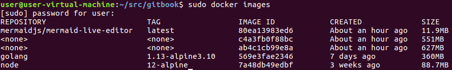
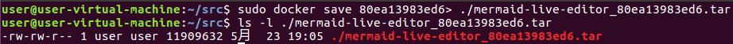

# 第三章 第10节：安装 mermaid live editor

## 制作并运行 [mermaid live editor](https://github.com/mermaidjs/mermaid-live-editor)镜像

```sh
cd ~/src/
sudo apt install docker.io
sudo service docker start
sudo docker build -t mermaidjs/mermaid-live-editor https://github.com/mermaidjs/mermaid-live-editor.git
sudo docker run -d -p 8000:8000 mermaidjs/mermaid-live-editor
```

打开 mermaid live editor: [http://localhost:8000](http://localhost:8000/)

## [docker镜像的导出与导入](https://jingyan.baidu.com/article/ce436649379e0a3772afd354.html)

如果服务器网路不好或者pull不下来镜像，只能在其它网路比较好的机器上pull下来镜像，导出成一个文件，再复制到网路不好的机器上，然后再从文件中导入进来，这样在网络不好的机器上也能使用docker镜像了。

1. 使用 sudo docker images 查看本机所有的镜像文件
    

2. sudo docker save 80ea13983ed6> ./mermaid-live-editor_80ea13983ed6.tar 将镜像保存为本地文件，其中80ea13983ed6为image id

3. 将保存到本地的文件上传到不能pull的服务器上，网络相通的情况下可以直接使用scp命令

4. 使用load方法加载刚才上传的tar文件

   sudo docker load < ./mermaid-live-editor_80ea13983ed6.tar 

5. 在新的机器上再此使用sudo docker images命令查看本机的镜像，检查刚才load的镜像有没有加载进来，发现加载进来的镜像名称、标签均为none，使用sudo docker tag 80ea13983ed6 mermaidjs/mermaid-live-editor:latest 修改为原来的镜像名称和标签名称，其中80ea13983ed6 为images id

6. 使用sudo docker run -d -p 8000:8000 mermaidjs/mermaid-live-editor 加载镜像，验证镜像是否能够成功的“run”

## Mermaid在线编辑器

* https://mermaid-js.github.io/mermaid-live-editor/#/edit/

