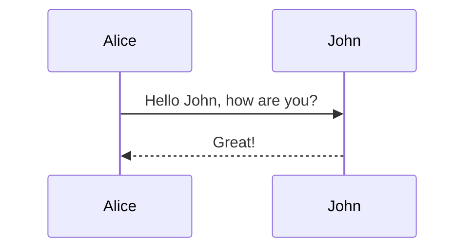

# 第三章 第2节：Sequence diagram

```markdown
<div class="mermaid">
    sequenceDiagram
    Alice->>John: Hello John, how are you?
    John-->>Alice: Great!
</div>
```

<div class="mermaid">
    sequenceDiagram
    Alice->>John: Hello John, how are you?
    John-->>Alice: Great!
</div>





