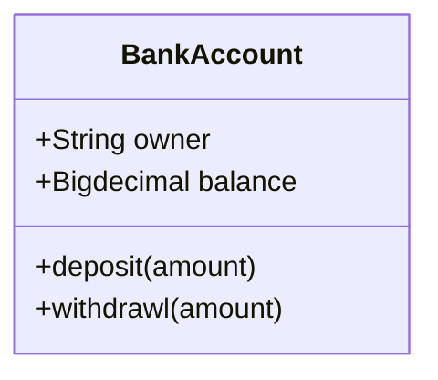

# 第三章 第3节：Class Diagram

## 暂时不支持

```markdown
<div class="mermaid">
classDiagram
    class BankAccount
    BankAccount : +String owner
    BankAccount : +Bigdecimal balance
    BankAccount : +deposit(amount)
    BankAccount : +withdrawl(amount)
</div>
```

<div class="mermaid">
classDiagram
    class BankAccount
    BankAccount : +String owner
    BankAccount : +Bigdecimal balance
    BankAccount : +deposit(amount)
    BankAccount : +withdrawl(amount)
</div>




