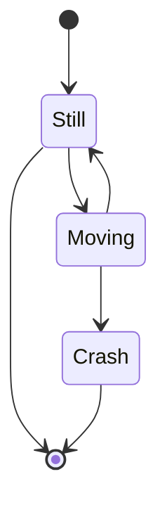

# 第三章 第4节：State Diagram

```markdown
<div class="mermaid">
    stateDiagram
    [*] --> Still
    Still --> [*]

    Still --> Moving
    Moving --> Still
    Moving --> Crash
    Crash --> [*]
</div>
```

<div class="mermaid">
    stateDiagram
    [*] --> Still
    Still --> [*]

    Still --> Moving
    Moving --> Still
    Moving --> Crash
    Crash --> [*]
</div>





